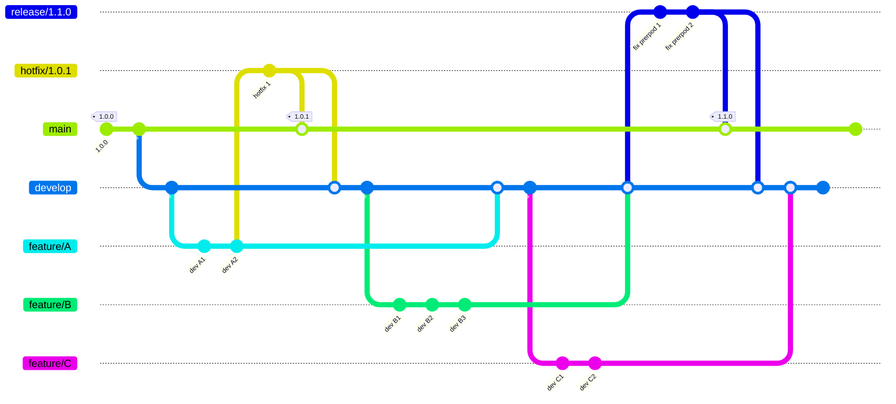
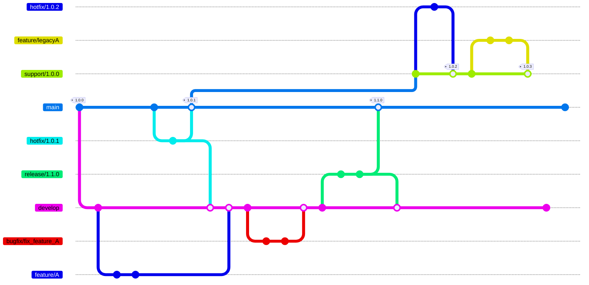

Git Flow est une méthodologie de gestion de branches pour Git, conçue pour faciliter le développement collaboratif et la livraison continue. Elle structure le cycle de vie du code source autour de plusieurs types de branches, chacune ayant un rôle précis.

<!--more-->

# La méthodologie Git Flow

## Les Branches Principales

- **main** : Contient le code de production stable.
- **develop** : Intègre les fonctionnalités terminées, en attente de mise en production.

## Les Branches de Support

- **feature/** : Pour le développement de nouvelles fonctionnalités.  
  Exemple : `feature/ajout-paiement-carte`
- **release/** : Préparation d'une nouvelle version de production.  
  Exemple : `release/1.2.0`
- **hotfix/** : Corrections urgentes sur la production.  
  Exemple : `hotfix/correction-bug-paiement`

## Cycle de Vie Typique

1. **Développement d'une fonctionnalité**

   - Créer une branche à partir de `develop` :  
     `git checkout develop`  
     `git checkout -b feature/ma-fonctionnalite`
   - Développer, puis fusionner dans `develop` à la fin :  
     `git checkout develop`  
     `git merge feature/ma-fonctionnalite`

2. **Préparation d'une release**

   - Créer une branche à partir de `develop` :  
     `git checkout develop`  
     `git checkout -b release/1.0.0`
   - Effectuer les derniers correctifs, puis fusionner dans `main` et `develop` :  
     `git checkout main`  
     `git merge release/1.0.0`  
     `git checkout develop`  
     `git merge release/1.0.0`

3. **Correction urgente (hotfix)**
   - Créer une branche à partir de `main` :  
     `git checkout main`  
     `git checkout -b hotfix/bug-critique`
   - Corriger, puis fusionner dans `main` et `develop` :  
     `git checkout main`  
     `git merge hotfix/bug-critique`  
     `git checkout develop`  
     `git merge hotfix/bug-critique`

## Graphe d’exécution



# Qu'est-ce que Git Flow AVH ?

## Origine

Git Flow AVH est une version améliorée de l’outil git-flow original, compatible avec les dernières versions de Git et intégrant de nombreuses corrections et fonctionnalités supplémentaires. Il facilite la gestion des branches et des versions dans un projet Git, en suivant une méthodologie structurée.

- git flow : Outil original créé par Vincent Driessen pour appliquer le workflow Git Flow.
- git flow AVH : Fork maintenu par Peter van der Does (AVH), avec de nombreuses améliorations et corrections.

## Compatibilité et maintenance

- git flow : Plus maintenu activement, peut poser des problèmes avec les versions récentes de Git.
- git flow AVH : Maintenu, compatible avec les dernières versions de Git, disponible sur la plupart des gestionnaires de paquets.

## Fonctionnalités supplémentaires

- Branches **bugfix/** : gestion native des corrections de bugs sur develop/support.
- Branches **support/** : maintenance de versions anciennes en parallèle.
- Options avancées : gestion des tags, hooks personnalisés, intégration continue facilitée.
- Plus de commandes et d’options : ex : git flow bugfix start, git flow support start, etc.
- **Meilleure gestion des conflits et des merges**.

# Outillage

## Installation

Git flow n’étant plus maintenu c'est c'est git flow avh qui se trouve par défaut dans la plus part des installation récente de git (c'est le cas de git pour windows)

## Initialisation

Dans le dossier de votre projet :

```powershell
git flow init
```

Suivez les instructions pour définir les noms des branches principales et de support.

```powershell
git flow init
Initialized empty Git repository in C:/Sources/gitflow/.git/
No branches exist yet. Base branches must be created now.
Branch name for production releases: [master]
Branch name for "next release" development: [develop]

How to name your supporting branch prefixes?
Feature branches? [feature/]
Bugfix branches? [bugfix/]
Release branches? [release/]
Hotfix branches? [hotfix/]
Support branches? [support/]
Version tag prefix? []
Hooks and filters directory? [C:/Sources/gitflow/.git/hooks]
```

> [!WARNING]
> Lors de l'exécution de l'initialisation si les branches support et hotfix ne sont pas demandées c'est gitflow et non pas gitflow avh qui s'exécute

## Commandes principales git flow

Git flow et Git flow Avh apportent à git des nouvelles commandes pour automatiser les process et n'avoir qu'une seule commande a chaque étape

### Une fonctionnalité :

```powershell
git flow feature start nom-fonctionnalite
git flow feature finish nom-fonctionnalite
```

### Une release :

```powershell
git flow release start 1.2.0
git flow release finish 1.2.0
```

### un hotfix :

```powershell
git flow hotfix start correction-critique
git flow hotfix finish correction-critique
```

## Commandes principales git flow avh

### une correction sur develop :

```powershell
git flow bugfix start correction-sur-develop
git flow bugfix finish correction-sur-develop
```

### une branche de support pour une vieille version a partir de son tag :

```powershell
git flow support start support/1.0.0 tags:/1.0.1
```

### un hotfix depuis une branche de support :

```powershell
git flow hotfix start correction-critique support/1.0.0
git flow hotfix finish correction-critique
```

### Une fonctionnalité depuis une branche de support :

```powershell
git flow feature start nom-fonctionnalite support/1.0.0
git flow feature finish nom-fonctionnalite
```

## Graphe d’exécution



# Bonnes pratiques

- Utilisez des noms explicites pour vos branches.
- Fusionnez régulièrement pour limiter les conflits.
- Utilisez les Pull Requests pour la revue de code.
- Documentez les releases et hotfixes dans vos messages de commit.

# Ressources

- [Documentation officielle Git Flow AVH](https://github.com/petervanderdoes/gitflow-avh)
- [Cheat Sheet Git Flow (EN)](https://danielkummer.github.io/git-flow-cheatsheet/)
- [Cheat Sheet Git Flow Avh (EN)](https://git.logikum.hu/flow)

# Bonus

Un squelete de script à addapeter powershell pour renommer les branches distantes d'un repo existant au format gitflow (a faire qu'une fois)

1. renomer les branche distantes :

```powershell
clear
cd C:\Sources\
$allBranches =  git branch -r
foreach($branchstr in $allBranches)
{
    $branch = $branchstr.substring(2)
     if(
         ($branch -ne "origin/master") -and
         ($branch -ne "origin/main") -and
         ($branch -ne "origin/develop") -and
         (-not $branch.StartsWith("origin/HEAD")) -and
          (-not $branch.StartsWith("origin/feature/")) -and
          (-not $branch.StartsWith("origin/release/")) -and
          (-not $branch.StartsWith("origin/hotfix/"))
        )
    {
       $new= $branch.Replace("origin/","feature/")
       $name=$branch.Replace("origin/","")
       echo $new
      Invoke-Expression "git push origin $($branch):refs/heads/$new :$name"
    }
}
```

2. renomer les branches locales et les rattacher aux branche renonmée (pour chaque devs) :

```powershell
clear
cd C:\Sources
$allBranches =  git branch
foreach($branchstr in $allBranches)
{
    $branch = $branchstr.substring(2)
     if(
         ($branch -ne "master") -and
         ($branch -ne "main") -and
         ($branch -ne "develop") -and
          (-not $branch.StartsWith("feature/")) -and
          (-not $branch.StartsWith("release/")) -and
          (-not $branch.StartsWith("hotfix/"))
        )
    {
       $new= $branch.Replace("origin/","feature/")
       $name=$branch.Replace("origin/","")
       echo $branch

       git branch -m $branch feature/$branch
       git branch -u origin/feature/$branch feature/$branch
    }
}
```
