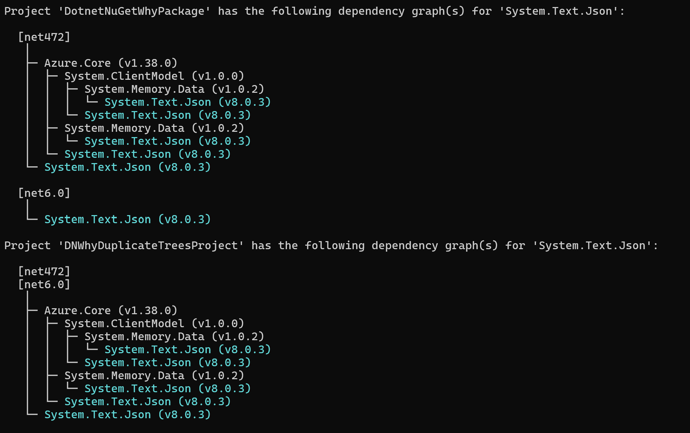

 
# Nugets

## Mettre à jour les packets d'un projet / d'une solution avec [dotnet-outdated-tool](https://github.com/dotnet-outdated/dotnet-outdated?tab=readme-ov-file) 

- installer l'outil :

`dotnet tool install --global dotnet-outdated-tool`
- voir les mis à jours :

`dotnet outdated --version-lock major`
- appliquer les mis à jours :

`dotnet outdated --version-lock major --upgrade`

Le version `--version-lock major` permet de blocker les mise a jours majour (ex 8.0.1 vers 8.0.6 et non 9.0.1)

## Comprendre d'où vient un package

La commande [dotnet nuget why](https://learn.microsoft.com/fr-fr/dotnet/core/tools/dotnet-nuget-why) commande affiche la graphe des dépendances d’un package particulier pour un projet ou une solution donné.
`dotnet nuget why <PROJECT|SOLUTION> <PACKAGE>`

## Voir l'arbre des packages 
- Installer [dotnet-nuget-tree](https://github.com/JulioRamos0/dotnet-nuget-tree)

`dotnet tool install --global dotnet-nuget-tree`
- Executer 

`dotnet-nuget-tree`

## Réinstaller tous les pacakges 
`Update-Package -reinstall`
