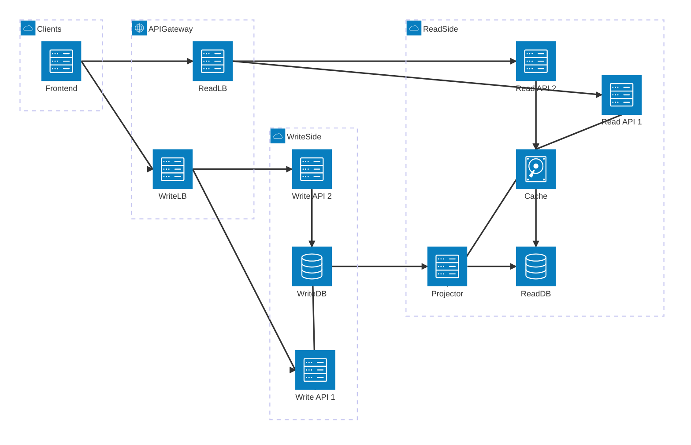

La séparation stricte entre lecture et écriture du pattern CQRS facilite le **scaling horizontal** : au lieu de rendre une seule machine toujours plus puissante (scaling vertical), on ajoute davantage d’instances spécialisées (APIs de lecture, réplicas, caches, bases dédiées) et on répartit la charge entre elles. Cependant, cela nécessite une architecture pensée pour la distribution et la gestion de la consistance éventuelle entre les modèles de lecture et d’écriture ainsi que l’utilisation de mécanismes de messagerie adaptés.

<!--more-->
 
# CQRS et le **scaling horizontal**

## 1. Séparer lecture et écriture pour scaler différemment

- Avec CQRS, vous avez deux pipelines bien distincts :
  - **écriture** (commands → domaine → base d’écriture),
  - **lecture** (events/projections → modèles de lecture → API de requête).
- Cela permet de **dimensionner séparément** :
  - les nœuds qui gèrent les écritures (moins nombreux, plus forts en cohérence, transactions),
  - les nœuds qui gèrent les lectures (beaucoup plus nombreux, plus simples, souvent stateless).

## 2. Scaling horizontal du côté lecture

- Les endpoints de **lecture** sont en général :
  - sans état métier complexe (read-only),
  - faciles à mettre derrière un **load balancer**,
  - souvent alimentés par des **vues matérialisées** ou caches.
- Il devient simple de multiplier les instances de services de lecture et/ou :
  - utiliser des **réplicas de base** (read-replicas),
  - utiliser des caches distribués (Redis, etc.),
  - rapprocher les lectures des utilisateurs (edge, CDN, régionales).

## 3. Scaling horizontal du côté écriture

- Le pipeline **écriture** reste centré sur la cohérence métier :
  - agrégats qui encapsulent les invariants,
  - transactions souvent limitées à un agrégat.
- Même si l’on a généralement moins d’instances d’écriture que de lecture, CQRS aide à :
  - isoler les points de contention (certains agrégats ou bounded contexts),
  - découper le domaine en **services / microservices** scalables horizontalement chacun pour sa partie d’écriture,
  - utiliser la **messagerie** (events, queues) pour absorber des pics.

Il est important de garder à l’esprit que la **base d’écriture** reste souvent un goulot d’étranglement potentiel : pour bénéficier pleinement du scaling horizontal côté écriture, CQRS doit être combiné à des stratégies de partitionnement ou de sharding par agrégat ou par bounded context (bases séparées, schémas distincts, clusters dédiés, etc.).

## 4. Bases séparées, scaling ciblé

- CQRS autorise (voire encourage) l’usage de **stores distincts** :
  - base transactionnelle optimisée pour l’écriture,
  - un ou plusieurs stores optimisés pour la lecture (SQL dénormalisé, NoSQL, recherche, time-series…).
- Chaque store peut être scalé horizontalement selon ses contraintes :
  - sharding ou réplicas côté lecture,
  - partitionnement par contexte ou agrégat côté écriture.

## 5. Consistance éventuelle assumée

- En séparant lecture et écriture, vous acceptez souvent une **consistance éventuelle** :
  - les vues de lecture et les réplicas ne sont pas toujours à T=0,
  - mais cela permet justement de **décorréler** les écritures des lectures et de scaler les lectures beaucoup plus agressivement.
- CQRS rend cette consistance éventuelle **explicite** (events, projections), ce qui est important quand on multiplie les nœuds et les stores.

Les impacts fonctionnels, UX et techniques de cette consistance éventuelle sont détaillés plus en profondeur dans la partie 4/6 de cette série, consacrée spécifiquement à ce sujet.

## En résumé

- CQRS ne fait pas “magiquement” le scaling horizontal, mais il **structure** l’architecture de façon à :
  - scaler massivement les **lectures** (plus d’instances, caches, réplicas),
  - scaler de façon plus ciblée les **écritures** (par agrégat, par contextes métier),
  - adapter indépendamment les technologies et stratégies de scaling de chaque côté.

# Exemple d’architecture CQRS scalable horizontalement

## 1. Vue d’ensemble

- **Front / API Gateway**
  - Un **load balancer / API Gateway** reçoit toutes les requêtes HTTP.
  - Il route :
    - les requêtes d’**écriture** vers le cluster “Write API”,
    - les requêtes de **lecture** vers le cluster “Read API”.

## 2. Côté écriture (Write side, scalable)

- **Cluster Write API**

  - Plusieurs instances : `Write API #1`, `Write API #2`, `Write API #3`, …
  - Ces services exposent uniquement des **commands** (POST/PUT/DELETE).
  - Chacune :
    - valide la commande,
    - charge l’agrégat de domaine (ex. `Order`),
    - applique les règles métier,
    - persiste dans la **base d’écriture**,
    - publie éventuellement des **événements** (`OrderCreated`, etc.).

- **Base d’écriture**
  - DB transactionnelle, normalisée.
  - Nombre d’instances plus restreint (cohérence forte, transactions).
  - Peut être partagée ou partitionnée par **bounded context** / par agrégat.

## 3. Côté lecture (Read side, très scalable)

- **Projections / Event Handlers**

  - Consomment les événements émis par le write side.
  - Mettent à jour une ou plusieurs **vues matérialisées** / modèles de lecture :
    - tables dénormalisées,
    - index de recherche,
    - vues agrégées (KPI, dashboards).

- **Cluster Read API**

  - Beaucoup plus d’instances possibles : `Read API #1…N`.
  - Exposent des **queries** (GET).
  - Lisent uniquement les **modèles de lecture** :
    - DB de lecture (SQL/NoSQL),
    - cache distribué (Redis, etc.),
    - éventuels **read replicas** géographiquement répartis.

- **Bases de lecture**
  - Une ou plusieurs bases spécialisées :
    - base SQL dénormalisée pour les écrans métiers,
    - index ElasticSearch pour la recherche,
    - time-series DB pour les métriques, etc.
  - Faciles à scaler horizontalement (sharding, réplicas, partitionnement).

## 4. Flux typique

1. **Écriture**

   - Le client envoie un `POST /orders` → Gateway → `Write API`.
   - `Write API` exécute `CreateOrderCommand` → agrégat `Order` → persistance en base d’écriture.
   - Un événement `OrderCreated` est publié.
   - Les projections consomment l’événement et mettent à jour `OrderReadModel` dans la base de lecture.

2. **Lecture**
   - Le client envoie un `GET /orders/{id}` → Gateway → `Read API`.
   - `Read API` interroge d’abord le **cache**, puis, si besoin, la **base de lecture**.
   - Réponse rapide, sans toucher à la base d’écriture ni aux agrégats.

## 5. Où intervient le scaling horizontal ?

- Vous pouvez augmenter indépendamment :
  - le **nombre d’instances Write API** (si le volume de commandes augmente),
  - le **nombre d’instances Read API** (souvent bien plus élevé, car 90–99 % du trafic est en lecture),
  - le **nombre de réplicas / shards** pour les bases de lecture,
  - la **capacité du cache distribué**.
- CQRS rend cette séparation structurelle naturelle, ce qui rend le scaling horizontal **ciblé** : vous scalez surtout là où il y a du trafic (lecture), sans casser le modèle transactionnel d’écriture.

## 6. Diagramme d’architecture

# Les bibliothèques CQRS en .NET et le scaling horizontal

La plupart des bibliothèques CQRS en .NET offrent un support natif pour le scaling horizontal en facilitant la séparation des responsabilités entre les commandes et les requêtes. Mais il faut faire attention à leur bus de messages : si celui-ci est "in memory" (en mémoire), il ne supportera pas le scaling horizontal. C'est au développeur de choisir une solution de messagerie externe (RabbitMQ, Azure Service Bus, Kafka, etc.) pour gérer la distribution des messages entre les différentes instances de services.

Certains frameworks proposent des **abstractions de bus** (interfaces de message broker, pipelines de publication/consommation), mais le choix du transport sous-jacent (RabbitMQ, Azure Service Bus, Kafka, etc.) et de son dimensionnement reste une décision d’infrastructure à part entière.
