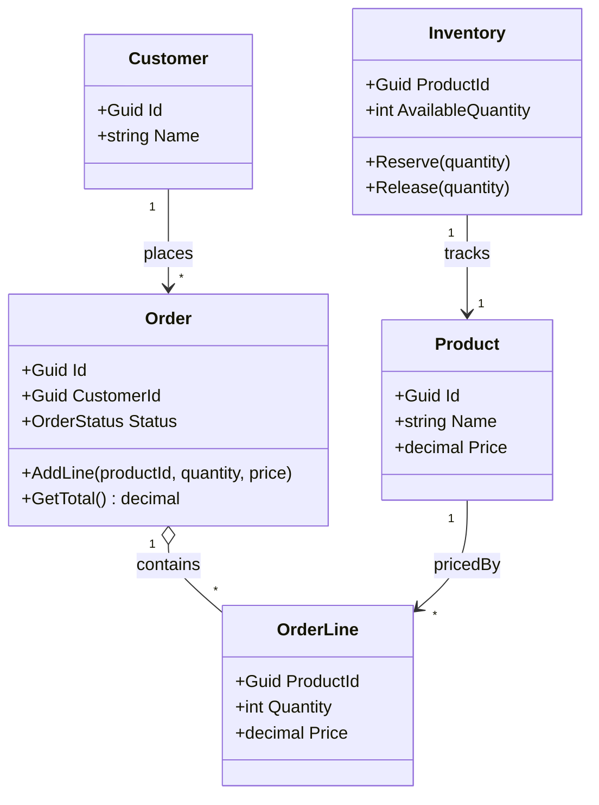
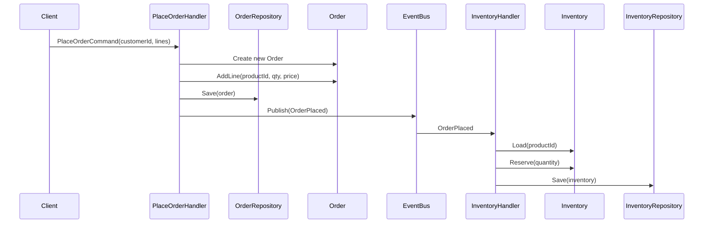

Dans le modèle CQRS/DDD, les **agrégats** jouent un rôle clé en tant que **frontières de cohérence et de transaction**. Une commande doit cibler un seul agrégat, cela simplifie les invariants métier, la conception des commandes, le schéma de base et le scaling.

<!--more-->
 
# Frontières transactionnelles et agrégats dans le contexte CQRS (et DDD)

## 1. Agrégat = frontière de cohérence

En DDD, un **agrégat** est un groupe cohérent d’objets métier (entités, value objects) :

- Il a une **racine d’agrégat** (Aggregate Root), seule entité exposée à l’extérieur.
- Les autres entités internes ne sont accessibles **que via la racine**.
- Toutes les **règles métier qui doivent être vraies “tout de suite”** (invariants forts) sont garanties à l’intérieur de cet agrégat.

Formulé autrement :

> Un agrégat est la plus petite unité de **cohérence forte** du modèle métier.

Exemples typiques :

- `Order` + `OrderLine` dans un agrégat `Order`.
- `Customer` + ses adresses dans un agrégat `Customer`.

## 2. Frontière transactionnelle

Dans un système bien conçu, surtout avec CQRS :

- **Une transaction de base de données = 1 agrégat**.
- Une commande (`Command`) **ne doit modifier qu’un seul agrégat** à la fois.
- Si vous avez besoin d’une cohérence immédiate **entre plusieurs agrégats**, c’est souvent un signe que :
  - soit vos frontières d’agrégats sont mal choisies,
  - soit vous devez accepter une **cohérence éventuelle** entre eux (events, sagas).

Pourquoi ?

- Plus la transaction touche d’objets / lignes / services, plus :
  - elle est lente,
  - elle bloque des ressources,
  - elle est difficile à faire scaler (surtout en distribué / microservices),
  - elle vous pousse vers des **transactions distribuées** (2PC) souvent non souhaitables.

En posant la règle “1 commande → 1 agrégat → 1 transaction”, vous :

- maîtrisez la **durée** et le **périmètre** de la transaction,
- facilitez comme corollaire :
  - le scaling (sharding par agrégat / clé),
  - la concurrence (moins de verrous),
  - la résilience (moins de dépendances synchrones).

## 3. Agrégats dans CQRS (côté écriture)

Dans CQRS, la notion d’agrégat concerne **surtout le write model** :

- Un handler de commande :
  - charge **un agrégat** par son ID (`Order`),
  - applique une intention (`AddOrderLine`, `ConfirmOrder`, etc.),
  - valide les invariants dans l’agrégat,
  - persiste l’agrégat (transaction locale),
  - émet éventuellement un ou plusieurs **événements de domaine** (`OrderConfirmed`, etc.).

Les modèles de lecture (projections, `OrderReadModel`, etc.) :

- peuvent **dé-normaliser** ou croiser plusieurs agrégats,
- mais ils n’ont **pas de frontière transactionnelle forte** au sens métier :
  - ils sont dérivés de l’écriture,
  - ils acceptent la cohérence éventuelle.

## 4. Comment choisir une frontière d’agrégat ?

Règle d’or :

> Un agrégat regroupe exactement ce qui doit rester **cohérent immédiatement** sous l’effet d’une commande donnée.

Quelques critères :

- **Invariants forts**

  - “Le total de la commande = somme des lignes” :  
    → `Order` + `OrderLine` dans le même agrégat.
  - “Le stock disponible ne doit jamais passer sous zéro” :
    - soit `Stock` fait partie du même agrégat que la réservation,
    - soit vous acceptez une éventuelle sur-réservation et vous corrigez via un workflow asynchrone.

- **Volume / granularité**

  - Un agrégat ne doit pas devenir énorme (des milliers d’objets internes) sinon :
    - les transactions deviennent lourdes,
    - les conflits de concurrence augmentent,
    - le chargement en mémoire est coûteux.

- **Fréquence d’accès concurrent**

  - Si deux parties du domaine sont très souvent modifiées en parallèle par des commandes différentes, les mettre dans le **même agrégat** crée des conflits de version récurrents (optimistic concurrency failures).
  - On préfère parfois **séparer en deux agrégats** + cohérence éventuelle via événements.

- **Indépendance métier**
  - Si deux sous-ensembles de données peuvent évoluer **sans se connaître** dans la plupart des cas, il est souvent raisonnable de les séparer en agrégats distincts.

- **Ne pas caler sur la technique**
  - Un agrégat ne correspond pas forcément à un écran, un endpoint ou une table SQL ; il est défini par les **invariants métier** qui doivent rester cohérents ensemble.

## 5. Conséquences pratiques

1. **Conception des commandes**

   - Une commande cible un agrégat par son ID (`OrderId`, `CustomerId`…).
   - Le handler ne touche qu’un seul agrégat.
   - S’il y a besoin de modifier autre chose :
    - émettre un événement de domaine,
    - laisser un autre handler (ou une saga/process manager) réagir de manière asynchrone.

2. **Schéma de base de données**

   - L’agrégat ne correspond pas forcément à **une table** :
     - il peut être réparti sur plusieurs tables (ex. `Orders` + `OrderLines`),
     - mais la **transaction** ne couvre que cet agrégat.
   - Les références à d’autres agrégats se font via **ID**, pas via navigation directe “fortement liée”.

3. **CQRS + Event Sourcing / messages**

   - Les frontières d’agrégats conditionnent :
     - la granularité des événements (`OrderCreated`, `OrderLineAdded`, etc.),
     - le design des **sagas / process managers** qui orchestrent plusieurs agrégats.

   Les **invariants qui concernent plusieurs agrégats** sont alors pris en charge par ces sagas / workflows asynchrones : ils ne sont donc plus garantis de manière atomique, mais via une cohérence éventuelle contrôlée.

4. **Scaling et partitionnement**
   - Un agrégat bien délimité est une excellente unité de **sharding** :
     - clé de partition = ID d’agrégat (ou dérivé),
     - chaque commande ne touche qu’une partition.

5. **Concurrence optimiste**

   - Techniquement, les agrégats sont souvent protégés par une **concurrence optimiste** (champ `Version` / `RowVersion`),
   - si deux commandes essaient de modifier le même agrégat en parallèle, l’une d’elles échoue sur un conflit de version,
   - cela permet de préserver les invariants de l’agrégat sans avoir recours à des verrous lourds ou à des transactions distribuées.

## 6. Exemple concret simplifié

Système de commandes :

- Agrégat `Order` :

  - racine : `Order` (Id, CustomerId, Status, …)
  - enfants : `OrderLine` (ProductId, Quantity, Price)
  - invariants :
    - une ligne ne peut pas avoir une quantité ≤ 0,
    - le total est cohérent avec les lignes,
    - on ne peut pas ajouter de lignes si la commande est “Closed”.

- Autres agrégats :
  - `Customer` (infos client),
  - `Product` (catalogue),
  - `Inventory` (stock).

Une commande `PlaceOrder` :

- Handler :
  - charge `Customer` (en lecture simple ou via un service) pour vérifier qu’il existe / est actif,
  - crée un nouvel agrégat `Order`,
  - ajoute des `OrderLine` (en se basant éventuellement sur le prix catalogue),
  - persiste `Order` dans sa transaction.

La cohérence avec `Inventory` (stock) :

- Soit elle est gérée dans un agrégat plus large `Inventory + Reservation` (si l’on veut une cohérence stricte),
- Soit par un **événement** `OrderPlaced` qui va déclencher :
  - une commande sur l’agrégat `Inventory` pour réserver ou décrémenter le stock,
  - avec gestion des cas “pas assez de stock” asynchronement (annulation, backorder, etc.).

En résumé :

- **L’agrégat** est la **frontière transactionnelle** naturelle côté écriture dans CQRS.
- Une **commande = 1 agrégat = 1 transaction** est une règle structurante qui :
  - clarifie où sont les invariants forts,
  - facilite les choix de cohérence éventuelle,
  - simplifie le scaling et la résilience.
- Le travail de conception consiste à **placer intelligemment ces frontières** en fonction des invariants, des volumes et des scénarios de concurrence, plutôt que selon la forme des écrans ou des tables SQL.
 - Ces choix de frontières d’agrégat conditionnent ensuite la manière dont la **consistance éventuelle** et l’**évolution de schéma** seront gérées, sujets approfondis dans les parties 4/6 et 6/6 de cette série.
