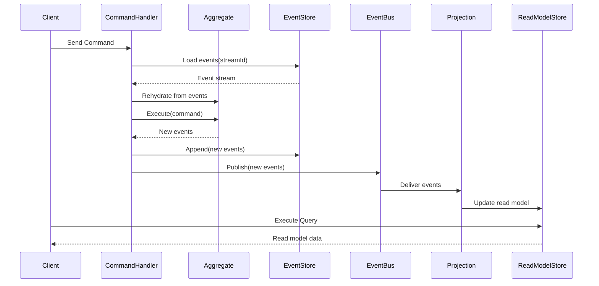

La combinaison de CQRS et d’Event Sourcing consiste à séparer lecture et écriture tout en conservant, côté écriture, l’historique complet des événements qui construisent les agrégats ; les mêmes événements alimentent ensuite des projections pour bâtir des modèles de lecture optimisés, avec à la clé auditabilité, rejouabilité et vues multiples au prix d’une complexité accrue.

<!--more-->

# Rôles respectifs

- **CQRS**  
  Sépare **écriture** (commands, agrégats, règles métier) et **lecture** (projections, modèles de lecture, vues optimisées).

- **Event Sourcing (ES)**  
  Au lieu de stocker l’“état courant” d’un agrégat, on stocke l’**historique des événements** qui l’ont construit, par exemple :  
  `OrderCreated`, `OrderLineAdded`, `OrderConfirmed`, `OrderShipped`, etc.  
  L’état courant est reconstruit en **rejouant les événements**.

CQRS n’implique pas forcément ES, et ES n’implique pas forcément CQRS, mais la combinaison des deux est très naturelle :

- côté écriture : agrégats **pilotés par événements** ;
- côté lecture : projections qui consomment les **mêmes événements** pour produire des modèles de lecture.

## Côté écriture avec Event Sourcing

Avec ES, le cycle “charger → modifier → sauver” d’un agrégat change :

1. **Chargement d’un agrégat**  
   - Au lieu de faire `SELECT * FROM Orders WHERE Id = ...`, on lit la **suite d’événements** depuis l’Event Store :  
     `OrderCreated`, `OrderLineAdded`, `OrderLineAdded`, `OrderConfirmed`, …  
   - L’agrégat **rejoue** ces événements dans l’ordre et reconstruit son état interne.

2. **Application d’une commande**  
   - Le handler de commande appelle des méthodes métier sur l’agrégat (par ex. `Confirm()`).
   - Ces méthodes **ne mutent pas directement l’état** ; elles produisent un ou plusieurs **événements nouveaux** (par ex. `OrderConfirmed`).

3. **Persistance**  
   - Au moment de “sauver”, on **append** les nouveaux événements à l’Event Store, en vérifiant une version (concurrence optimiste).

4. **Émission d’événements**  
   - Les mêmes événements sont publiés sur un bus (message broker) pour être consommés par les projections de lecture, autres services, sagas, etc.

L’agrégat est donc essentiellement :

- une logique de **validation / invariants**,  
- un **replay** d’événements historiques,  
- un générateur de **nouveaux événements** en réaction aux commandes.

Exemple simplifié d’agrégat event‑sourcé :

```csharp
public sealed class Order
{
  private readonly List<OrderLine> _lines = new();

  public Guid Id { get; private set; }
  public OrderStatus Status { get; private set; } = OrderStatus.Draft;

  public void Apply(OrderCreated @event)
  {
    Id = @event.OrderId;
    Status = OrderStatus.Draft;
  }

  public void Apply(OrderLineAdded @event)
  {
    _lines.Add(new OrderLine(@event.ProductId, @event.Quantity, @event.Price));
  }

  public void Apply(OrderConfirmed @event)
  {
    Status = OrderStatus.Confirmed;
  }

  public IEnumerable<object> Confirm()
  {
    if (Status != OrderStatus.Draft)
      throw new InvalidOperationException("Order must be in Draft state to be confirmed.");

    yield return new OrderConfirmed(Id, DateTime.UtcNow);
  }
}
```

Les méthodes `Apply` servent au **replay** depuis l’Event Store, tandis que les méthodes métier (comme `Confirm`) émettent de nouveaux événements qui seront persistés, sans muter directement l’état.

## Event Store : rôle et contraintes

L’Event Store est une base spécialisée (ou une table bien conçue) qui stocke :

- un **flux d’événements par agrégat** (stream) :  
  `(AggregateId, Version, EventType, Payload, Timestamp, Metadata…)`

Points importants :

- **Append-only** : on ne supprime ni ne met à jour les événements ; on ajoute de nouveaux événements (sauf cas de RGPD, correction exceptionnelle, etc.).
- **Concurrence optimiste** :  
  - on lit jusqu’à la version `n`,  
  - on tente d’écrire des événements en disant “je m’attends à être à la version `n`”,  
  - si quelqu’un a déjà écrit en `n+1`, on a un conflit (replay + re-tentative).
- **Sécurité / conformité** : les événements peuvent contenir des données sensibles → chiffrement, masquage, politiques de rétention.

Dans certains cas (par exemple pour respecter le RGPD), les événements applicatifs ne contiennent que des identifiants techniques, et les données personnelles sont stockées dans une table séparée, éventuellement chiffrée, ce qui permet d’anonymiser ou de supprimer ces données sans modifier l’historique des événements métier.

#  Projections : construire les modèles de lecture

CQRS + ES s’exprime pleinement via les **projections** :

- Chaque projection est un composant qui :
  - s’abonne à un ou plusieurs types d’événements,  
  - met à jour un **modèle de lecture** (table SQL dénormalisée, index de recherche, cache, etc.).

Exemple :

- Projection “OrderReadModel” consomme :
  - `OrderCreated` → insère une ligne avec statut “Draft”, total = 0, etc.  
  - `OrderLineAdded` → met à jour les lignes, recalcule un total matérialisé.  
  - `OrderConfirmed` → passe le statut à “Confirmed”.  

Caractéristiques :

- **Idempotence** :  
  - si un événement est traité deux fois, la projection ne doit pas dupliquer les effets (par ex., recalculer à partir d’un total = somme des lignes plutôt qu’ajouter +X à chaque fois).
- **Ré-ouvrabilité** :  
  - en cas de bug, on peut souvent **dropper** la projection et la reconstruire en rejouant tout l’historique.

## Reconstruire l’état et rejouer l’historique

L’un des grands atouts d’Event Sourcing :

- On peut **rejouer tout l’historique** pour :
  - reconstruire un agrégat (pour déboguer ou enquêter),  
  - reconstruire un ou plusieurs modèles de lecture après changement de schéma,  
  - calculer de **nouvelles projections** a posteriori (nouvelles vues, nouveaux KPI).

Processus typique de replay :

1. On arrête (ou isole) la projection concernée.
2. On efface ou archive son modèle de lecture.
3. On relit les événements depuis le début (ou depuis un point donné) et on appelle à nouveau les handlers de projection.
4. On remet en production une fois à jour.

Cela a un coût (temps de replay, ressources), mais c’est très puissant pour l’évolution du système dans le temps.

### Snapshots et optimisations de relecture

Lorsque le nombre d’événements par agrégat devient important, rejouer toute l’histoire à chaque chargement peut devenir coûteux. Deux optimisations classiques sont alors utilisées :

- **Snapshots d’agrégat**  
  Périodiquement (par exemple toutes les N versions), on persiste un **snapshot** de l’état courant de l’agrégat. Au prochain chargement, on repart de ce snapshot puis l’on rejoue uniquement les événements plus récents.

- **Partitionnement des streams**  
  Organiser les flux d’événements par agrégat ou par groupe d’agrégats (sharding) pour faciliter la distribution de la charge et limiter la taille de chaque stream.

Ces optimisations ne changent pas le modèle conceptuel, mais améliorent fortement la performance de relecture lorsque les historiques deviennent volumineux.

## Versionnage et évolution des événements

Un point critique : les événements sont **durables** dans le temps ; ils vivent plus longtemps que votre code actuel.

Problèmes typiques :

- Changement de structure : `OrderCreated` v1 → v2 (nouveaux champs, renommage).
- Ajout/suppression de champs, changement de types.

Stratégies :

- **Versionner les types d’événements**  
  - `OrderCreatedV1`, `OrderCreatedV2`, …  
  - Les consommateurs savent gérer plusieurs versions (ou on écrit des adaptateurs).
- **Upcasters / converters**  
  - À la lecture, transformer les anciens événements vers la forme nouvelle attendue par le code, sans modifier le store.
- **Éviter les breaking changes**  
  - Ajouter des champs facultatifs, conserver la sémantique des champs existants autant que possible.

## Sagas / Process Managers

Avec CQRS + ES, la coordination de **plusieurs agrégats** ou de **plusieurs bounded contexts** se fait souvent via :

- des **sagas** (ou process managers), qui :
  - écoutent des événements (`OrderPlaced`, `PaymentCompleted`, etc.),
  - envoient des **commandes** à d’autres agrégats (`ReserveInventory`, `CapturePayment`, etc.),
  - gardent un **état interne de workflow** (en Event Sourcing ou en stockage classique),
  - gèrent les cas d’erreur, de timeouts, de compensation.

CQRS + ES donne à ces sagas une **source d’information riche** (les événements) pour prendre des décisions, tracer les enchaînements et rejouer des scénarios.

# Consistance éventuelle et CQRS + ES

Avec ES, la consistance éventuelle est encore plus visible :

- Les projections de lecture **consomment des événements** qui sont eux-mêmes la vérité d’écriture.  
- Toute latence dans :
  - l’écriture dans l’Event Store,  
  - la livraison des événements,  
  - le traitement des projections,  
  se traduit en délai avant mise à jour des vues.

D’où l’importance :

- d’un **pipeline d’événements** robuste (broker, retry, DLQ),  
- de **métriques** de latence de projection,  
- d’une bonne **conception UX** (comme évoqué dans la section consacrée à la consistance éventuelle).

## Avantages de CQRS + Event Sourcing

- **Audit complet**  
  - On sait *quoi* s’est passé, *quand*, *dans quel ordre*, *avec quelles données*.
- **Débogage et analyse**  
  - Rejouer une chronologie complète pour comprendre un bug, un comportement métier ou un cas litigieux.
- **Nouvelles vues tardives**  
  - Besoin d’un nouveau reporting ? Créer une nouvelle projection et rejouer tout l’historique.
- **Évolution métier**  
  - L’historique permet de revisiter la compréhension du domaine et de calculer de nouveaux indicateurs.

## Coûts et complexité

En contrepartie, CQRS + ES apporte une **complexité importante** :

- Modélisation des événements et de leurs versions dans la durée.
- Gestion de l’Event Store (taille, performance, rétention).
- Mise en place et supervision des projections, sagas, bus de messages.
- Besoin d’une équipe à l’aise avec ces concepts (DDD, systèmes distribués, messaging).

Il est généralement pertinent dans des contextes où :

- le **domaine métier est riche** et évolutif ;  
- l’**historique exact** des changements a une grande valeur (audit, finance, logistique, conformité) ;  
- on a besoin de **nombreuses vues** projetées (reporting, analytics, APIs variées) ;  
- le volume ou la criticité justifie l’investissement technique.

À l’inverse, Event Sourcing est souvent **surdimensionné** pour :

- des applications CRUD simples (back‑offices administratifs, écrans de paramétrage) où l’historique complet n’apporte pas de valeur significative ;
- des systèmes à faible complexité métier et faible volume, où une base relationnelle “classique” et quelques logs applicatifs suffisent ;
- des équipes ou contextes où les concepts DDD/CQRS/ES ne sont pas encore maîtrisés et où la priorité est à la simplicité opérationnelle.


