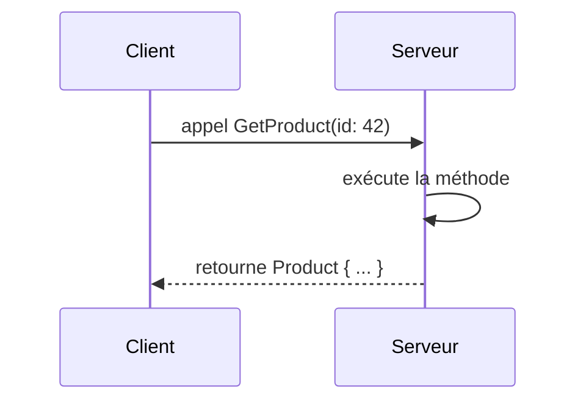

gRPC (gRPC Remote Procedure Call) est un framework open source de communication inter-processus développé par Google. Il repose sur **HTTP/2** et **Protocol Buffers (Protobuf)** pour offrir des appels distants fortement typés, performants et multi-langages. Là où REST/HTTP domine les APIs publiques depuis des années, gRPC s'impose de plus en plus pour la **communication inter-services**, notamment dans les architectures microservices. Cet article explique ce qu'est gRPC, comment il fonctionne, et dans quels cas le préférer (ou non) à HTTP/REST.

<!--more-->

# Qu'est-ce que gRPC ?

gRPC est un protocole d'appel de procédure à distance (RPC). Le principe est simple : on appelle une méthode sur un service distant **comme si c'était un appel local**. Le framework se charge de la sérialisation, du transport réseau, et de la désérialisation de la réponse.


Contrairement à REST, où l'on raisonne en **ressources** et **verbes HTTP** (`GET /products/42`), gRPC raisonne en **services** et **méthodes** (`ProductService.GetProduct`).

# Les fondations de gRPC

## Protocol Buffers (Protobuf)

Protobuf est le format de sérialisation par défaut de gRPC. C'est un format **binaire**, compact et fortement typé, défini via des fichiers `.proto` :

```protobuf
syntax = "proto3";

package catalog;

// Définition du service
service ProductService {
  rpc GetProduct (GetProductRequest) returns (Product);
  rpc ListProducts (ListProductsRequest) returns (ProductList);
}

// Messages (DTOs)
message GetProductRequest {
  int32 id = 1;
}

message ListProductsRequest {
  int32 page = 1;
  int32 page_size = 2;
}

message Product {
  int32 id = 1;
  string name = 2;
  string description = 3;
  double price = 4;
  bool in_stock = 5;
}

message ProductList {
  repeated Product products = 1;
  int32 total_count = 2;
}
```

Les chiffres (`= 1`, `= 2`, etc.) sont des **identifiants de champ**, pas des valeurs. Ils permettent la compatibilité lors de l'évolution du schéma.

À partir de ce fichier, le compilateur `protoc` (ou les build tools intégrés à .NET, Go, Java, etc.) **génère automatiquement** le code client et serveur dans le langage ciblé.

### Pourquoi du binaire ?

| Aspect | JSON (REST) | Protobuf (gRPC) |
|--------|-------------|-----------------|
| Format | Texte, lisible | Binaire, compact |
| Taille | ~100 octets pour un objet simple | ~30-50 octets pour le même objet |
| Parsing | Lent (parsing texte, allocation strings) | Rapide (lecture directe de bytes) |
| Schéma | Optionnel (OpenAPI/Swagger) | Obligatoire (`.proto`) |

Le binaire est plus petit sur le réseau et plus rapide à sérialiser/désérialiser. En revanche, il n'est pas lisible directement (on ne peut pas l'inspecter avec un simple `curl`).

## HTTP/2

gRPC utilise **HTTP/2** comme transport, ce qui apporte :

- **Multiplexage** : plusieurs requêtes/réponses en parallèle sur une seule connexion TCP (pas de head-of-line blocking comme en HTTP/1.1).
- **Header compression** (HPACK) : les headers sont compressés, ce qui réduit la bande passante.
- **Binary framing** : les données sont envoyées en frames binaires, au lieu de texte.
- **Server push** : le serveur peut envoyer des données sans que le client ne les ait demandées (utilisé en interne par gRPC pour le streaming).

REST/HTTP peut aussi utiliser HTTP/2, mais en pratique la plupart des APIs REST fonctionnent en HTTP/1.1 avec JSON.

# Les 4 types de communication gRPC

C'est l'un des grands avantages de gRPC : il supporte nativement **4 modes de communication** :

## 1. Unary (requête-réponse classique)

Un appel, une réponse. Équivalent d'un `GET` ou `POST` en REST.

```protobuf
rpc GetProduct (GetProductRequest) returns (Product);
```

## 2. Server Streaming

Le client envoie une requête, le serveur renvoie un **flux de réponses**.

```protobuf
rpc ListProducts (ListProductsRequest) returns (stream Product);
```

Cas d'usage : exporter un grand nombre de résultats, flux de logs, notifications en temps réel.

## 3. Client Streaming

Le client envoie un **flux de requêtes**, le serveur renvoie une seule réponse à la fin.

```protobuf
rpc UploadProducts (stream Product) returns (UploadSummary);
```

Cas d'usage : upload de fichiers par morceaux, ingestion de données en batch.

## 4. Bidirectional Streaming

Les deux côtés envoient et reçoivent des flux simultanément.

```protobuf
rpc Chat (stream ChatMessage) returns (stream ChatMessage);
```

Cas d'usage : chat en temps réel, synchronisation bidirectionnelle, pipelines de traitement.

En REST, pour obtenir du streaming on doit recourir à des solutions annexes (WebSocket, SSE), qui ne sont pas intégrées nativement au protocole.

# gRPC en .NET : exemple complet

## Créer un service gRPC

```dotnetcli
dotnet new grpc -n ProductApi
```

### Définir le contrat (`Protos/product.proto`)

```protobuf
syntax = "proto3";

option csharp_namespace = "ProductApi";

package catalog;

service ProductService {
  rpc GetProduct (GetProductRequest) returns (Product);
  rpc ListProducts (Empty) returns (stream Product);
}

message GetProductRequest {
  int32 id = 1;
}

message Product {
  int32 id = 1;
  string name = 2;
  double price = 3;
}

message Empty {}
```

### Référencer dans le `.csproj`

```xml
<ItemGroup>
  <Protobuf Include="Protos\product.proto" GrpcServices="Server" />
</ItemGroup>
```

### Implémenter le service

```csharp
using Grpc.Core;
using ProductApi;

public class ProductServiceImpl : ProductService.ProductServiceBase
{
    private static readonly List<Product> Products =
    [
        new() { Id = 1, Name = "Clavier mécanique", Price = 89.99 },
        new() { Id = 2, Name = "Souris gaming", Price = 59.99 },
        new() { Id = 3, Name = "Écran 4K", Price = 449.99 }
    ];

    // Unary : une requête, une réponse
    public override Task<Product> GetProduct(GetProductRequest request, ServerCallContext context)
    {
        var product = Products.FirstOrDefault(p => p.Id == request.Id)
            ?? throw new RpcException(new Status(StatusCode.NotFound,
                $"Produit {request.Id} introuvable"));

        return Task.FromResult(product);
    }

    // Server streaming : une requête, N réponses
    public override async Task ListProducts(
        Empty request,
        IServerStreamWriter<Product> responseStream,
        ServerCallContext context)
    {
        foreach (var product in Products)
        {
            await responseStream.WriteAsync(product);
            await Task.Delay(500); // Simule un traitement
        }
    }
}
```

### Configurer `Program.cs`

```csharp
var builder = WebApplication.CreateBuilder(args);
builder.Services.AddGrpc();

var app = builder.Build();
app.MapGrpcService<ProductServiceImpl>();

app.Run();
```

## Créer le client

```dotnetcli
dotnet new console -n ProductClient
cd ProductClient
dotnet add package Grpc.Net.Client
dotnet add package Google.Protobuf
dotnet add package Grpc.Tools
```

Référencer le même `.proto` en mode client :

```xml
<ItemGroup>
  <Protobuf Include="..\ProductApi\Protos\product.proto" GrpcServices="Client"
            Link="Protos\product.proto" />
</ItemGroup>
```

### Appel unary

```csharp
using Grpc.Net.Client;
using ProductApi;

var channel = GrpcChannel.ForAddress("http://localhost:5001");
var client = new ProductService.ProductServiceClient(channel);

// Appel unary
var product = await client.GetProductAsync(new GetProductRequest { Id = 1 });
Console.WriteLine($"{product.Name} - {product.Price} €");
```

### Appel server streaming

```csharp
// Server streaming : lire un flux de produits
using var stream = client.ListProducts(new Empty());

await foreach (var product in stream.ResponseStream.ReadAllAsync())
{
    Console.WriteLine($"Reçu : {product.Name} - {product.Price} €");
}
```

# Avantages de gRPC par rapport à HTTP/REST

## Performance

- **Sérialisation binaire (Protobuf)** : 5 à 10x plus compact que JSON, 10x plus rapide à sérialiser/désérialiser.
- **HTTP/2** : multiplexage, compression des headers, réduction de la latence.
- **Connexions persistantes** : pas de surcoût de connexion TCP à chaque requête.

En pratique, pour des charges élevées (milliers d'appels par seconde entre services), gRPC peut diviser la latence par 2 à 5 par rapport à REST/JSON.

## Contrat fort et génération de code

- Le fichier `.proto` est le **contrat unique** entre client et serveur.
- Le code est **généré automatiquement** dans tous les langages supportés (C#, Java, Go, Python, Rust, etc.).
- Toute incompatibilité est détectée **à la compilation**, pas au runtime.

En REST, le contrat (OpenAPI/Swagger) est souvent optionnel, maintenu manuellement, et les erreurs de schéma ne se révèlent qu'à l'exécution.

## Streaming natif

gRPC supporte 4 modes de communication nativement, là où REST est limité au modèle requête-réponse. Pour du streaming, REST nécessite des solutions ad hoc (WebSocket, Server-Sent Events).

## Multi-langage

Le même fichier `.proto` génère des clients et serveurs dans tous les langages supportés. Un service C# peut être appelé par un client Go ou Python sans écrire de code d'intégration.

## Évolution du schéma

Protobuf permet d'**ajouter des champs** sans casser les clients existants (les champs inconnus sont ignorés), grâce aux identifiants numériques de champ. C'est plus robuste que l'évolution d'un schéma JSON.

# Inconvénients de gRPC par rapport à HTTP/REST

## Pas lisible par un humain

Le format binaire de Protobuf n'est **pas lisible** directement. On ne peut pas inspecter les requêtes/réponses avec un simple `curl` ou un navigateur. Il faut des outils spécifiques :

- **grpcurl** : équivalent de curl pour gRPC
- **gRPC UI** : interface graphique (comme Postman pour gRPC)
- **Postman** : supporte gRPC depuis la v10
- **Reflection** : le service peut exposer ses `.proto` pour que les outils les découvrent dynamiquement

```bash
# grpcurl : lister les services
grpcurl -plaintext localhost:5001 list

# grpcurl : appeler une méthode
grpcurl -plaintext -d '{"id": 1}' localhost:5001 catalog.ProductService/GetProduct
```

## Pas adapté aux navigateurs web (sans proxy)

Les navigateurs ne supportent pas nativement gRPC (pas d'API JavaScript pour HTTP/2 frames). Il faut passer par :

- **gRPC-Web** : un protocole adapté pour les navigateurs, avec un proxy (Envoy) ou un middleware côté serveur.
- **Un gateway REST** : qui traduit les appels REST en appels gRPC (ex. : grpc-gateway).

En .NET, le middleware gRPC-Web se configure simplement :

```csharp
var app = builder.Build();

app.UseGrpcWeb(); // Active gRPC-Web
app.MapGrpcService<ProductServiceImpl>().EnableGrpcWeb();
```

Mais cela reste une couche supplémentaire par rapport à une API REST directement consommable par un navigateur.

## Complexité de mise en place

- Il faut gérer les fichiers `.proto`, le compilateur Protobuf, la génération de code.
- Le debugging est plus complexe (binaire, outils spécifiques).
- L'infrastructure doit supporter HTTP/2 (certains load balancers, proxys ou CDN ne le supportent pas bien).

## Moins d'écosystème pour les APIs publiques

REST/HTTP est le standard universel pour les APIs publiques. La quasi-totalité des outils, documentations et intégrations tierces supposent du REST/JSON. gRPC est plus adapté à la **communication interne** entre microservices.

## Load balancing côté client

En HTTP/1.1, chaque requête ouvre une connexion, donc un load balancer L4 répartit naturellement les requêtes. En gRPC (HTTP/2), une seule connexion persistante peut envoyer toutes les requêtes, ce qui contourne le load balancing L4. Solutions :

- **Load balancing L7** (Envoy, Nginx avec gRPC support)
- **Client-side load balancing** (le client connaît les instances et répartit lui-même)
- **Service mesh** (Istio, Linkerd) ou **Dapr**

# Comparatif synthétique

| Critère | HTTP/REST + JSON | gRPC + Protobuf |
|---------|-----------------|-----------------|
| **Format** | Texte (JSON) | Binaire (Protobuf) |
| **Transport** | HTTP/1.1 ou HTTP/2 | HTTP/2 obligatoire |
| **Contrat** | Optionnel (OpenAPI) | Obligatoire (`.proto`) |
| **Génération de code** | Optionnelle | Automatique |
| **Performance** | Bon | Excellent (2-10x plus rapide) |
| **Taille des messages** | ~2-5x plus gros | Compact (binaire) |
| **Streaming** | SSE, WebSocket (ad hoc) | Natif (4 modes) |
| **Lisibilité** | Oui (curl, navigateur) | Non (outils spécifiques) |
| **Navigateur** | Natif | gRPC-Web + proxy |
| **APIs publiques** | Standard | Rare |
| **Communication inter-services** | Bon | Excellent |
| **Écosystème** | Universel | En croissance |
| **Load balancing** | Simple (L4) | Nécessite L7 ou client-side |
| **Évolution du schéma** | Fragile (JSON) | Robuste (identifiants numériques) |

# Quand utiliser quoi ?

## Choisir HTTP/REST quand :

- L'API est consommée par des **navigateurs** ou des **clients externes**.
- La **simplicité** et la **lisibilité** sont prioritaires.
- L'écosystème tiers (documentation, portails développeurs, intégrations) est important.
- Les performances ne sont pas critiques (charges modérées).

## Choisir gRPC quand :

- La communication est **interne** entre microservices.
- Les **performances** sont critiques (haute fréquence, faible latence).
- Vous avez besoin de **streaming** (temps réel, flux de données).
- Vous travaillez dans un environnement **multi-langage** et voulez un contrat unique.
- Vous voulez des **garanties de compatibilité** à la compilation.

## Combiner les deux

L'approche la plus courante est de **combiner les deux** :

```
                    REST/JSON                         gRPC/Protobuf
Navigateur/Mobile ──────────▶ API Gateway ──────────────────────▶ Microservices internes
                              (REST → gRPC)             ◀────────▶ (gRPC entre eux)
```

- **REST** en façade pour les clients externes.
- **gRPC** en interne entre les services pour la performance et les contrats typés.
- Un **API Gateway** ou un **BFF** (Backend For Frontend) fait la traduction.

# Résumé

gRPC est un protocole RPC moderne, performant et fortement typé, idéal pour la communication inter-services. Ses avantages principaux — **sérialisation binaire, streaming natif, contrats générés, multi-langage** — en font un choix solide pour les architectures microservices. En revanche, son format binaire, sa dépendance à HTTP/2 et sa moindre accessibilité pour les navigateurs le rendent moins adapté aux APIs publiques, où REST/JSON reste le standard. En pratique, les deux protocoles coexistent souvent dans la même architecture, chacun utilisé là où il excelle.
