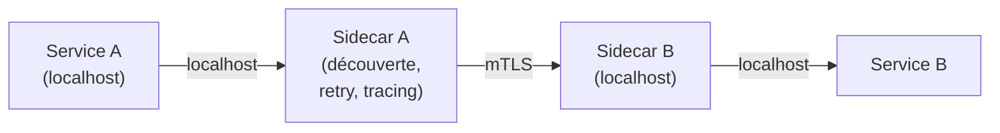

L'invocation de service (Service Invocation) est l'un des building blocks fondamentaux de Dapr. Il permet à un service d'appeler un autre service par son **app-id**, sans connaître son adresse IP ni son port, avec découverte automatique, load balancing, retry, chiffrement mTLS et traçabilité intégrés. En .NET, le SDK Dapr et `HttpClient` offrent plusieurs façons d'exploiter ce mécanisme.

<!--more-->


# Le problème

Dans une architecture microservices classique, appeler un autre service implique de gérer :

- La **découverte de service** : où se trouve le service cible ? Quelle est son URL ?
- Le **load balancing** : comment répartir les appels entre plusieurs instances ?
- La **résilience** : comment gérer les timeouts, les retries, le circuit breaking ?
- La **sécurité** : comment chiffrer les communications inter-services (mTLS) ?
- L'**observabilité** : comment tracer un appel de bout en bout entre plusieurs services ?

Sans Dapr, il faut combiner un service mesh (Istio, Linkerd), un reverse proxy, des bibliothèques de résilience (Polly), un registre de services (Consul, Eureka), etc. Dapr regroupe tout cela dans son sidecar.

# Fonctionnement de l'invocation de service

Lorsqu'un service A veut appeler un service B :

1. Le service A fait un appel HTTP ou gRPC vers **son propre sidecar** Dapr (sur `localhost`).
2. Le sidecar de A résout le nom du service B (via le **name resolution component**).
3. Le sidecar de A envoie la requête au **sidecar de B** (avec mTLS automatique).
4. Le sidecar de B transmet la requête à l'application B sur son port local.
5. La réponse fait le chemin inverse.


Tout se passe de manière transparente : le service A ne connaît que le **app-id** du service B et le nom de la méthode à appeler.

# L'API HTTP Dapr

L'invocation de service passe par l'endpoint suivant du sidecar :

```
POST/GET/PUT/DELETE http://localhost:<dapr-port>/v1.0/invoke/<app-id>/method/<method-name>
```

- `<dapr-port>` : port HTTP du sidecar (3500 par défaut).
- `<app-id>` : identifiant unique du service cible (défini au lancement avec `--app-id`).
- `<method-name>` : route de l'endpoint exposé par le service cible.

### Exemple avec curl

```bash
# Appeler GET /weatherforecast sur le service "weather-api"
curl http://localhost:3500/v1.0/invoke/weather-api/method/weatherforecast

# Appeler POST /orders sur le service "order-service"
curl -X POST http://localhost:3500/v1.0/invoke/order-service/method/orders \
  -H "Content-Type: application/json" \
  -d '{"productId": 42, "quantity": 2}'
```

# Invocation de service en .NET

Le SDK Dapr pour .NET fournit plusieurs approches pour invoquer un service.

## Installation

```dotnetcli
dotnet add package Dapr.AspNetCore
```

Ce package inclut `DaprClient` et les extensions ASP.NET Core.

## 1. Utiliser `DaprClient` directement

`DaprClient` est le client principal du SDK Dapr. Il encapsule les appels HTTP/gRPC vers le sidecar.

### Enregistrement dans le conteneur DI

```csharp
var builder = WebApplication.CreateBuilder(args);
builder.Services.AddDaprClient();

var app = builder.Build();
```

### Appels de service

```csharp
public class OrderService
{
    private readonly DaprClient _daprClient;

    public OrderService(DaprClient daprClient)
    {
        _daprClient = daprClient;
    }

    // Appel POST avec body et réponse typée
    public async Task<OrderConfirmation> CreateOrderAsync(Order order)
    {
        return await _daprClient.InvokeMethodAsync<Order, OrderConfirmation>(
            HttpMethod.Post,
            "order-service",   // app-id du service cible
            "orders",          // route de l'endpoint
            order);            // body de la requête
    }

    // Appel GET avec réponse typée
    public async Task<WeatherForecast[]> GetWeatherAsync()
    {
        return await _daprClient.InvokeMethodAsync<WeatherForecast[]>(
            HttpMethod.Get,
            "weather-api",
            "weatherforecast");
    }

    // Appel sans réponse (fire and forget)
    public async Task NotifyAsync(Notification notification)
    {
        await _daprClient.InvokeMethodAsync(
            "notification-service",
            "notify",
            notification);
    }
}
```

### Signatures disponibles

`InvokeMethodAsync` propose plusieurs surcharges :

| Surcharge | Description |
|-----------|-------------|
| `InvokeMethodAsync<TResponse>(method, appId, methodName)` | Appel sans body, avec réponse typée |
| `InvokeMethodAsync<TRequest, TResponse>(method, appId, methodName, data)` | Appel avec body et réponse typée |
| `InvokeMethodAsync(appId, methodName, data)` | Appel POST avec body, sans réponse |
| `InvokeMethodAsync(method, appId, methodName)` | Appel sans body ni réponse |

### Gestion des erreurs

En cas d'erreur HTTP (4xx, 5xx), `DaprClient` lève une `InvocationException` (ou `RpcException` en gRPC). On peut la capturer pour récupérer le code de statut :

```csharp
try
{
    var result = await _daprClient.InvokeMethodAsync<Order, OrderConfirmation>(
        HttpMethod.Post, "order-service", "orders", order);
}
catch (InvocationException ex)
{
    Console.WriteLine($"Erreur {ex.Response.StatusCode} lors de l'appel à order-service");
    var body = await ex.Response.Content.ReadAsStringAsync();
    Console.WriteLine($"Détail : {body}");
}
```

## 2. Utiliser `HttpClient` avec `DaprClient`

Pour ceux qui préfèrent travailler avec `HttpClient` (par habitude ou pour bénéficier de `IHttpClientFactory`), Dapr fournit `DaprClient.CreateInvokeHttpClient()` :

```csharp
builder.Services.AddSingleton(sp =>
    new DaprClientBuilder().Build().CreateInvokeHttpClient("order-service"));
```

On obtient un `HttpClient` précconfiguré dont le `BaseAddress` pointe vers le sidecar avec le bon app-id. On l'utilise comme n'importe quel `HttpClient` :

```csharp
public class OrderService
{
    private readonly HttpClient _httpClient;

    public OrderService(HttpClient httpClient)
    {
        _httpClient = httpClient;
    }

    public async Task<OrderConfirmation?> CreateOrderAsync(Order order)
    {
        var response = await _httpClient.PostAsJsonAsync("/orders", order);
        response.EnsureSuccessStatusCode();
        return await response.Content.ReadFromJsonAsync<OrderConfirmation>();
    }

    public async Task<WeatherForecast[]?> GetWeatherAsync()
    {
        return await _httpClient.GetFromJsonAsync<WeatherForecast[]>("/weatherforecast");
    }
}
```

Cette approche est intéressante car elle permet de **réutiliser tout l'écosystème `HttpClient`** (.NET), y compris les `DelegatingHandler`, la sérialisation `System.Text.Json`, les extensions `Microsoft.Extensions.Http`, etc.

## 3. Utiliser `IHttpClientFactory` (approche recommandée)

Pour tirer parti de `IHttpClientFactory` et de ses avantages (gestion du pool de connexions, named/typed clients, handlers), on peut combiner Dapr avec un named client :

```csharp
builder.Services.AddHttpClient("order-service", client =>
{
    // Le base address pointe vers le sidecar Dapr
    // DAPR_HTTP_PORT est 3500 par défaut
    var daprPort = Environment.GetEnvironmentVariable("DAPR_HTTP_PORT") ?? "3500";
    client.BaseAddress = new Uri($"http://localhost:{daprPort}/v1.0/invoke/order-service/method/");
});
```

```csharp
public class OrderService
{
    private readonly HttpClient _httpClient;

    public OrderService(IHttpClientFactory httpClientFactory)
    {
        _httpClient = httpClientFactory.CreateClient("order-service");
    }

    public async Task<OrderConfirmation?> CreateOrderAsync(Order order)
    {
        // L'URL relative est ajoutée au base address
        // → http://localhost:3500/v1.0/invoke/order-service/method/orders
        var response = await _httpClient.PostAsJsonAsync("orders", order);
        response.EnsureSuccessStatusCode();
        return await response.Content.ReadFromJsonAsync<OrderConfirmation>();
    }
}
```

Cette approche est la **plus idiomatique en .NET** et permet d'ajouter facilement des handlers de résilience supplémentaires (via `Microsoft.Extensions.Http.Resilience` par exemple).

# Côté service appelé

Le service cible est une API ASP.NET Core standard. Aucune configuration Dapr spécifique n'est nécessaire pour être invocable :

```csharp
var builder = WebApplication.CreateBuilder(args);
var app = builder.Build();

app.MapGet("/weatherforecast", () =>
{
    var forecasts = Enumerable.Range(1, 5).Select(i => new WeatherForecast
    {
        Date = DateOnly.FromDateTime(DateTime.Now.AddDays(i)),
        TemperatureC = Random.Shared.Next(-20, 55),
        Summary = "Sunny"
    });
    return forecasts;
});

app.MapPost("/orders", (Order order) =>
{
    // Traitement de la commande...
    return Results.Ok(new OrderConfirmation
    {
        OrderId = Guid.NewGuid(),
        Status = "Created"
    });
});

app.Run();
```

Le sidecar Dapr intercepte les requêtes entrantes et les transmet à l'application sur le port configuré (`--app-port`).

# Contrôle d'accès

Dapr permet de restreindre quels services peuvent invoquer quels autres services, via une **App Policy** :

```yaml
apiVersion: dapr.io/v1alpha1
kind: Configuration
metadata:
  name: daprConfig
spec:
  accessControl:
    defaultAction: deny
    policies:
      - appId: frontend
        defaultAction: deny
        trustDomain: "public"
        namespace: "default"
        operations:
          - name: /orders
            httpVerb: ["POST"]
            action: allow
          - name: /weatherforecast
            httpVerb: ["GET"]
            action: allow
```

Cette configuration autorise uniquement le service `frontend` à appeler `POST /orders` et `GET /weatherforecast`, et refuse tout le reste par défaut.

# Résilience intégrée

Dapr fournit des politiques de résilience configurables via YAML, sans code :

```yaml
apiVersion: dapr.io/v1alpha1
kind: Resiliency
metadata:
  name: resiliency
spec:
  policies:
    retries:
      retryOnError:
        policy: constant
        duration: 1s
        maxRetries: 3
    circuitBreakers:
      mainBreaker:
        maxRequests: 1
        interval: 10s
        timeout: 30s
        trip: consecutiveFailures > 5
    timeouts:
      generalTimeout: 5s
  targets:
    apps:
      order-service:
        retry: retryOnError
        circuitBreaker: mainBreaker
        timeout: generalTimeout
```

Avec cette configuration, les appels vers `order-service` bénéficient automatiquement de :
- **3 retries** avec un délai de 1 seconde entre chaque tentative,
- un **circuit breaker** qui s'ouvre après 5 échecs consécutifs,
- un **timeout** de 5 secondes par appel.

Tout cela sans ajouter une seule ligne de code dans les services.

# Lancement en local

Pour tester l'invocation de service en local, on lance chaque service avec son sidecar :

```bash
# Terminal 1 : lancer le service météo
dapr run --app-id weather-api --app-port 5001 -- dotnet run --project WeatherApi

# Terminal 2 : lancer le service de commandes
dapr run --app-id order-service --app-port 5002 -- dotnet run --project OrderService

# Terminal 3 : lancer le frontend qui appelle les deux autres
dapr run --app-id frontend --app-port 5000 -- dotnet run --project Frontend
```

Dapr utilise mDNS en mode standalone pour la découverte de services entre sidecars sur la même machine.

# Lancement avec .NET Aspire

Si vous utilisez **.NET Aspire**, l'orchestration des sidecars est automatique :

```csharp
var builder = DistributedApplication.CreateBuilder(args);

var weatherApi = builder.AddProject<Projects.WeatherApi>("weather-api")
    .WithDaprSidecar();

var orderService = builder.AddProject<Projects.OrderService>("order-service")
    .WithDaprSidecar();

builder.AddProject<Projects.Frontend>("frontend")
    .WithDaprSidecar()
    .WithReference(weatherApi)
    .WithReference(orderService);

builder.Build().Run();
```

# Invocation gRPC

Par défaut, la communication entre sidecars utilise **gRPC** (plus performant que HTTP). La communication entre l'application et son propre sidecar peut être en HTTP ou en gRPC selon la configuration.

Pour forcer l'utilisation de gRPC côté client SDK :

```csharp
builder.Services.AddDaprClient(daprBuilder =>
{
    daprBuilder.UseGrpcEndpoint("http://localhost:50001");
});
```

L'invocation gRPC natif (Protobuf) est aussi possible pour des services qui exposent des endpoints gRPC plutôt que REST, via le proxy gRPC de Dapr.

# Résumé

| Aspect | Détail |
|--------|--------|
| **API** | `POST/GET/PUT/DELETE http://localhost:3500/v1.0/invoke/{app-id}/method/{method}` |
| **Découverte** | Automatique (mDNS en local, Kubernetes DNS en cluster) |
| **Sécurité** | mTLS automatique entre sidecars + access control policies |
| **Résilience** | Retry, circuit breaker, timeout configurables en YAML |
| **Observabilité** | Traces distribuées automatiques (OpenTelemetry) |
| **SDK .NET** | `DaprClient.InvokeMethodAsync`, `CreateInvokeHttpClient`, ou `IHttpClientFactory` |
| **Service cible** | API ASP.NET Core standard, aucune dépendance Dapr requise |

L'invocation de service Dapr offre une abstraction puissante qui élimine la complexité de la communication inter-services, tout en laissant la liberté d'utiliser des APIs HTTP standard côté application.
