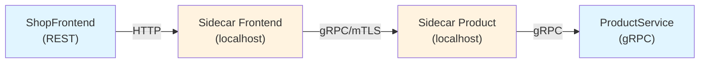

Dans l'article précédent, nous avons vu comment Dapr simplifie l'invocation de service via HTTP. Mais Dapr supporte aussi nativement **gRPC**, à la fois entre les sidecars et entre votre application et son sidecar. gRPC apporte des avantages significatifs : sérialisation binaire (Protobuf), contrats fortement typés, streaming, et de meilleures performances. Dans cet article, on met en place un exemple complet : un service gRPC invoqué via Dapr, et un client qui l'appelle.

<!--more-->


# Rappel : HTTP vs gRPC dans Dapr

Dapr utilise déjà gRPC pour la communication **entre sidecars**. Mais la communication entre votre application et son sidecar peut être :

- **HTTP** (par défaut) : votre app parle en HTTP au sidecar sur le port 3500.
- **gRPC** : votre app parle en gRPC au sidecar sur le port 50001.

Indépendamment de cela, le **service cible** lui-même peut exposer :

- des endpoints **HTTP/REST** classiques (Minimal API, contrôleurs),
- des endpoints **gRPC natifs** (via `Grpc.AspNetCore`).

Dapr sait router vers l'un ou l'autre. Dans cet article, on va construire un **service gRPC natif** appelé via Dapr.

# Architecture de l'exemple

On va créer deux projets :

1. **ProductService** : un service gRPC qui expose un endpoint pour récupérer un produit par son ID.
2. **ShopFrontend** : une API REST qui appelle `ProductService` via Dapr pour afficher les détails d'un produit.



# Étape 1 : Créer le service gRPC (ProductService)

## Créer le projet

```dotnetcli
dotnet new grpc -n ProductService
cd ProductService
```

## Définir le contrat Protobuf

On remplace le fichier `Protos/greet.proto` par notre contrat `Protos/product.proto` :

```protobuf
syntax = "proto3";

option csharp_namespace = "ProductService";

package product;

// Le service exposé
service ProductCatalog {
  rpc GetProduct (GetProductRequest) returns (ProductReply);
  rpc GetProducts (GetProductsRequest) returns (GetProductsReply);
}

// Requêtes
message GetProductRequest {
  int32 product_id = 1;
}

message GetProductsRequest {
  // Pas de filtre pour simplifier
}

// Réponses
message ProductReply {
  int32 product_id = 1;
  string name = 2;
  string description = 3;
  double price = 4;
  bool in_stock = 5;
}

message GetProductsReply {
  repeated ProductReply products = 1;
}
```

## Référencer le proto dans le .csproj

```xml
<ItemGroup>
  <Protobuf Include="Protos\product.proto" GrpcServices="Server" />
</ItemGroup>
```

## Implémenter le service

```csharp
using Grpc.Core;
using ProductService;

namespace ProductService.Services;

public class ProductCatalogService : ProductCatalog.ProductCatalogBase
{
    private static readonly List<ProductReply> _products =
    [
        new() { ProductId = 1, Name = "Clavier mécanique", Description = "Clavier RGB switches red", Price = 89.99, InStock = true },
        new() { ProductId = 2, Name = "Souris gaming", Description = "Souris sans fil 25000 DPI", Price = 59.99, InStock = true },
        new() { ProductId = 3, Name = "Écran 27 pouces", Description = "Écran 4K IPS 144Hz", Price = 449.99, InStock = false }
    ];

    public override Task<ProductReply> GetProduct(GetProductRequest request, ServerCallContext context)
    {
        var product = _products.FirstOrDefault(p => p.ProductId == request.ProductId);

        if (product is null)
        {
            throw new RpcException(new Status(StatusCode.NotFound,
                $"Produit {request.ProductId} introuvable"));
        }

        return Task.FromResult(product);
    }

    public override Task<GetProductsReply> GetProducts(GetProductsRequest request, ServerCallContext context)
    {
        var reply = new GetProductsReply();
        reply.Products.AddRange(_products);
        return Task.FromResult(reply);
    }
}
```

## Configurer `Program.cs`

```csharp
var builder = WebApplication.CreateBuilder(args);

builder.Services.AddGrpc();

var app = builder.Build();

app.MapGrpcService<ProductCatalogService>();

app.Run();
```

Le service écoute sur un port configuré dans `appsettings.json` ou `launchSettings.json`. Pour Dapr, on le fait écouter en HTTP/2 (requis par gRPC) :

```json
{
  "Kestrel": {
    "Endpoints": {
      "Grpc": {
        "Url": "http://localhost:5001",
        "Protocols": "Http2"
      }
    }
  }
}
```

> **Important** : on utilise `http` (pas `https`) car c'est le sidecar Dapr qui gère le mTLS entre les services. Entre l'application et son propre sidecar, on reste en communication locale non chiffrée.

# Étape 2 : Créer le client (ShopFrontend)

## Créer le projet

```dotnetcli
dotnet new web -n ShopFrontend
cd ShopFrontend
dotnet add package Dapr.AspNetCore
dotnet add package Google.Protobuf
dotnet add package Grpc.Net.Client
dotnet add package Grpc.Tools
```

## Ajouter le proto côté client

On copie le même fichier `product.proto` dans le projet `ShopFrontend/Protos/product.proto`, puis on le référence en mode **Client** dans le `.csproj` :

```xml
<ItemGroup>
  <Protobuf Include="Protos\product.proto" GrpcServices="Client" />
</ItemGroup>
```

Cela génère automatiquement le client gRPC typé `ProductCatalog.ProductCatalogClient`.

## Configurer `Program.cs`

```csharp
using Dapr.Client;
using ProductService;

var builder = WebApplication.CreateBuilder(args);

builder.Services.AddDaprClient();

var app = builder.Build();

// GET /products → liste tous les produits via Dapr + gRPC
app.MapGet("/products", async (DaprClient daprClient) =>
{
    var request = daprClient.CreateInvokeMethodRequest(
        HttpMethod.Post,
        "product-service",
        "product.ProductCatalog/GetProducts");

    // Sérialiser le body Protobuf en bytes
    var protoRequest = new GetProductsRequest();
    request.Content = new ByteArrayContent(protoRequest.ToByteArray());
    request.Content.Headers.ContentType =
        new System.Net.Http.Headers.MediaTypeHeaderValue("application/grpc");

    var response = await daprClient.InvokeMethodAsync<GetProductsReply>(
        "product-service",
        "product.ProductCatalog/GetProducts");

    return response.Products.Select(p => new
    {
        p.ProductId,
        p.Name,
        p.Description,
        p.Price,
        p.InStock
    });
});

app.Run();
```

Cependant, cette approche mélange du Protobuf manuel avec le SDK Dapr HTTP. En pratique, l'approche la plus propre est d'utiliser le **proxy gRPC de Dapr**.

# L'approche recommandée : le proxy gRPC de Dapr

Le sidecar Dapr expose un **proxy gRPC transparent**. On crée un `GrpcChannel` qui pointe vers le sidecar, et on ajoute un header `dapr-app-id` pour indiquer le service cible. Le sidecar se charge du routage.

## Configuration du client gRPC via le proxy Dapr

```csharp
using Grpc.Core;
using Grpc.Net.Client;
using ProductService;

var builder = WebApplication.CreateBuilder(args);

// Créer le channel gRPC vers le sidecar Dapr
var daprGrpcPort = Environment.GetEnvironmentVariable("DAPR_GRPC_PORT") ?? "50001";
var channel = GrpcChannel.ForAddress($"http://localhost:{daprGrpcPort}");

// Enregistrer le client gRPC typé
builder.Services.AddSingleton(new ProductCatalog.ProductCatalogClient(channel));

var app = builder.Build();

app.MapGet("/products/{id:int}", async (int id, ProductCatalog.ProductCatalogClient client) =>
{
    // Ajouter le header dapr-app-id pour cibler le bon service
    var headers = new Metadata
    {
        { "dapr-app-id", "product-service" }
    };

    try
    {
        var reply = await client.GetProductAsync(
            new GetProductRequest { ProductId = id },
            headers);

        return Results.Ok(new
        {
            reply.ProductId,
            reply.Name,
            reply.Description,
            reply.Price,
            reply.InStock
        });
    }
    catch (RpcException ex) when (ex.StatusCode == StatusCode.NotFound)
    {
        return Results.NotFound(new { Message = ex.Status.Detail });
    }
});

app.MapGet("/products", async (ProductCatalog.ProductCatalogClient client) =>
{
    var headers = new Metadata
    {
        { "dapr-app-id", "product-service" }
    };

    var reply = await client.GetProductsAsync(
        new GetProductsRequest(),
        headers);

    return reply.Products.Select(p => new
    {
        p.ProductId,
        p.Name,
        p.Description,
        p.Price,
        p.InStock
    });
});

app.Run();
```

C'est l'approche **la plus propre** : on utilise le client gRPC généré par Protobuf tel quel, avec les contrats fortement typés, et Dapr gère le routage via le header `dapr-app-id`.

## Simplifier avec `IHttpClientFactory` et `GrpcClientFactory`

Pour une intégration plus idiomatique avec le conteneur DI de .NET :

```dotnetcli
dotnet add package Grpc.Net.ClientFactory
```

```csharp
using Grpc.Core;
using ProductService;

var builder = WebApplication.CreateBuilder(args);

var daprGrpcPort = Environment.GetEnvironmentVariable("DAPR_GRPC_PORT") ?? "50001";

// Enregistrer le client gRPC via la factory
builder.Services
    .AddGrpcClient<ProductCatalog.ProductCatalogClient>(options =>
    {
        options.Address = new Uri($"http://localhost:{daprGrpcPort}");
    })
    .AddCallCredentials((context, metadata) =>
    {
        // Ajouter le header dapr-app-id automatiquement à chaque appel
        metadata.Add("dapr-app-id", "product-service");
        return Task.CompletedTask;
    });

var app = builder.Build();

// Les endpoints sont plus simples : plus besoin de gérer le header manuellement
app.MapGet("/products/{id:int}", async (int id, ProductCatalog.ProductCatalogClient client) =>
{
    try
    {
        var reply = await client.GetProductAsync(
            new GetProductRequest { ProductId = id });

        return Results.Ok(new
        {
            reply.ProductId,
            reply.Name,
            reply.Description,
            reply.Price,
            reply.InStock
        });
    }
    catch (RpcException ex) when (ex.StatusCode == StatusCode.NotFound)
    {
        return Results.NotFound(new { Message = ex.Status.Detail });
    }
});

app.MapGet("/products", async (ProductCatalog.ProductCatalogClient client) =>
{
    var reply = await client.GetProductsAsync(new GetProductsRequest());

    return reply.Products.Select(p => new
    {
        p.ProductId,
        p.Name,
        p.Description,
        p.Price,
        p.InStock
    });
});

app.Run();
```

Avec `AddGrpcClient` + `AddCallCredentials`, le header `dapr-app-id` est injecté automatiquement dans chaque appel. Le code des endpoints est propre et ne contient plus aucune référence à Dapr.

# Lancement de l'exemple

## En local avec le CLI Dapr

```bash
# Terminal 1 : lancer le service gRPC
dapr run --app-id product-service \
         --app-port 5001 \
         --app-protocol grpc \
         -- dotnet run --project ProductService

# Terminal 2 : lancer le frontend
dapr run --app-id shop-frontend \
         --app-port 5000 \
         -- dotnet run --project ShopFrontend
```

Le flag `--app-protocol grpc` est essentiel pour le service cible : il indique au sidecar que l'application derrière lui parle gRPC (et non HTTP).

## Tester

```bash
# Récupérer tous les produits
curl http://localhost:5000/products

# Récupérer un produit par ID
curl http://localhost:5000/products/1

# Produit inexistant → 404
curl http://localhost:5000/products/99
```

## Avec .NET Aspire

```csharp
var builder = DistributedApplication.CreateBuilder(args);

var productService = builder.AddProject<Projects.ProductService>("product-service")
    .WithDaprSidecar(new DaprSidecarOptions
    {
        AppProtocol = "grpc"
    });

builder.AddProject<Projects.ShopFrontend>("shop-frontend")
    .WithDaprSidecar()
    .WithReference(productService);

builder.Build().Run();
```

# Partager le fichier proto entre projets

Pour éviter de copier le `.proto` manuellement, une bonne pratique est de créer un projet partagé :

```
Solution/
├── Protos/
│   └── product.proto
├── ProductService/
│   └── ProductService.csproj
├── ShopFrontend/
│   └── ShopFrontend.csproj
```

Dans chaque `.csproj`, on référence le proto avec un chemin relatif :

```xml
<!-- ProductService.csproj -->
<ItemGroup>
  <Protobuf Include="..\Protos\product.proto" GrpcServices="Server"
            Link="Protos\product.proto" />
</ItemGroup>

<!-- ShopFrontend.csproj -->
<ItemGroup>
  <Protobuf Include="..\Protos\product.proto" GrpcServices="Client"
            Link="Protos\product.proto" />
</ItemGroup>
```

Ainsi, toute modification du contrat est reflétée des deux côtés à la compilation.

# Gestion des erreurs gRPC

Les erreurs gRPC sont représentées par des `StatusCode` (similaires aux codes HTTP). Dapr les propage fidèlement :

| StatusCode gRPC | Signification |
|-----------------|---------------|
| `OK` | Succès |
| `NotFound` | Ressource introuvable |
| `InvalidArgument` | Paramètre invalide |
| `PermissionDenied` | Accès refusé |
| `Internal` | Erreur interne du service |
| `Unavailable` | Service indisponible |

Côté service, on lève une `RpcException` :

```csharp
throw new RpcException(new Status(StatusCode.NotFound, "Produit introuvable"));
```

Côté client, on la capte :

```csharp
try
{
    var reply = await client.GetProductAsync(request);
}
catch (RpcException ex) when (ex.StatusCode == StatusCode.NotFound)
{
    // Gérer le 404
}
catch (RpcException ex) when (ex.StatusCode == StatusCode.Unavailable)
{
    // Le service est down
}
```

# Résilience

Les mêmes politiques de résilience Dapr (retry, circuit breaker, timeout) s'appliquent aux appels gRPC :

```yaml
apiVersion: dapr.io/v1alpha1
kind: Resiliency
metadata:
  name: resiliency
spec:
  policies:
    retries:
      grpcRetry:
        policy: constant
        duration: 2s
        maxRetries: 3
    timeouts:
      grpcTimeout: 10s
  targets:
    apps:
      product-service:
        retry: grpcRetry
        timeout: grpcTimeout
```

# HTTP vs gRPC : quand choisir quoi ?

| Critère | HTTP/REST | gRPC |
|---------|-----------|------|
| **Contrat** | Loose (JSON, OpenAPI optionnel) | Strict (Protobuf, `.proto` obligatoire) |
| **Performance** | Bon (JSON texte) | Excellent (binaire, HTTP/2) |
| **Streaming** | Limité (SSE, WebSocket) | Natif (unary, server, client, bidirectionnel) |
| **Outillage navigateur** | curl, Postman, fetch | Nécessite grpcurl ou grpc-web |
| **Interopérabilité** | Universelle | Nécessite un client Protobuf |
| **Cas d'usage** | APIs publiques, frontend | Communication inter-services |

En règle générale :
- **HTTP/REST** pour les APIs exposées aux clients externes (navigateurs, apps mobiles).
- **gRPC** pour la **communication inter-services** interne où la performance et les contrats typés comptent.

Dapr permet de mixer les deux dans la même architecture, chaque service choisissant son protocole indépendamment.

# Résumé

| Aspect | Détail |
|--------|--------|
| **Protocole** | gRPC natif via le proxy du sidecar Dapr |
| **Routage** | Header `dapr-app-id` sur le channel gRPC |
| **Flag service** | `--app-protocol grpc` au lancement du service cible |
| **Client .NET** | `GrpcChannel` + client Protobuf généré, ou `AddGrpcClient` avec factory |
| **Contrat** | Fichier `.proto` partagé entre client et serveur |
| **Résilience** | Retry, circuit breaker, timeout via config YAML Dapr |
| **Sécurité** | mTLS automatique entre sidecars |

L'invocation gRPC via Dapr combine le meilleur des deux mondes : les **contrats typés et les performances de gRPC** avec la **simplicité opérationnelle de Dapr** (découverte, résilience, sécurité, observabilité), le tout sans couplage direct entre les services.
