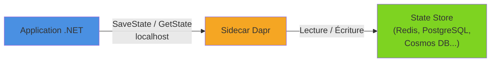

La gestion d'état (State Management) est l'un des building blocks essentiels de Dapr. Il fournit une API clé/valeur unifiée pour stocker, lire, supprimer et transactionner de l'état, avec concurrence optimiste (ETags), sans coupler votre code à un store spécifique. En .NET, le SDK Dapr rend cette API simple et idiomatique.

<!--more-->


# Le problème

Dans une architecture microservices, chaque service gère idéalement son propre état. Mais stocker cet état soulève plusieurs questions :

- **Quel store utiliser ?** Redis, PostgreSQL, Cosmos DB, MongoDB… Chaque choix implique un SDK différent, une sérialisation différente, des patterns de connexion différents.
- **Concurrence** : que se passe-t-il quand deux instances du même service tentent de modifier la même clé en même temps ?
- **Transactions** : comment garantir l'atomicité de plusieurs écritures simultanées ?
- **Portabilité** : comment changer de store (ex. : passer de Redis en développement à Cosmos DB en production) sans réécrire le code ?
- **Résolution de conflits** : comment gérer les conflits de mise à jour (first-write-wins vs last-write-wins) ?

Sans Dapr, il faut intégrer le SDK de chaque store, gérer les connexions, les retries, la sérialisation, et coupler fortement son code à un fournisseur particulier. Dapr résout tout cela avec une API unifiée exposée par le sidecar.

# Fonctionnement

Le state store de Dapr fonctionne sur le principe **clé/valeur** :

1. Votre application appelle le sidecar Dapr sur `localhost` (HTTP ou gRPC).
2. Le sidecar transmet la requête au **composant de state store** configuré (Redis, PostgreSQL, Cosmos DB…).
3. Le sidecar gère la sérialisation (JSON par défaut), les ETags pour la concurrence optimiste, et les retries.



Chaque état est stocké avec une **clé** composée automatiquement par Dapr : `<app-id>||<key>`. Cela évite les collisions entre services partageant le même store.

# Configuration du composant

Le composant de state store est défini dans un fichier YAML. Voici quelques exemples :

## Redis (développement local)

```yaml
apiVersion: dapr.io/v1alpha1
kind: Component
metadata:
  name: statestore
spec:
  type: state.redis
  version: v1
  metadata:
    - name: redisHost
      value: "localhost:6379"
    - name: redisPassword
      value: ""
```

## PostgreSQL

```yaml
apiVersion: dapr.io/v1alpha1
kind: Component
metadata:
  name: statestore
spec:
  type: state.postgresql
  version: v1
  metadata:
    - name: connectionString
      value: "host=localhost user=postgres password=secret dbname=daprstate sslmode=disable"
```

## Azure Cosmos DB

```yaml
apiVersion: dapr.io/v1alpha1
kind: Component
metadata:
  name: statestore
spec:
  type: state.azure.cosmosdb
  version: v1
  metadata:
    - name: url
      value: "https://myaccount.documents.azure.com:443/"
    - name: masterKey
      value: "<cosmos-key>"
    - name: database
      value: "daprstate"
    - name: collection
      value: "state"
```

Le point clé : **le code applicatif est identique**, quel que soit le composant choisi. On change de store en modifiant uniquement le fichier YAML.

# Gestion d'état en .NET

## Installation

```dotnetcli
dotnet add package Dapr.AspNetCore
```

## Enregistrement dans le conteneur DI

```csharp
var builder = WebApplication.CreateBuilder(args);
builder.Services.AddDaprClient();

var app = builder.Build();
app.Run();
```

## Opérations CRUD de base

### Sauvegarder un état

```csharp
public class CartService
{
    private readonly DaprClient _daprClient;
    private const string StoreName = "statestore";

    public CartService(DaprClient daprClient)
    {
        _daprClient = daprClient;
    }

    public async Task SaveCartAsync(string userId, ShoppingCart cart)
    {
        await _daprClient.SaveStateAsync(StoreName, $"cart-{userId}", cart);
    }
}
```

L'objet `ShoppingCart` est sérialisé automatiquement en JSON et stocké sous la clé `cart-{userId}`.

### Lire un état

```csharp
public async Task<ShoppingCart?> GetCartAsync(string userId)
{
    return await _daprClient.GetStateAsync<ShoppingCart>(StoreName, $"cart-{userId}");
}
```

Si la clé n'existe pas, la méthode retourne `default(T)` (donc `null` pour un type référence).

### Supprimer un état

```csharp
public async Task ClearCartAsync(string userId)
{
    await _daprClient.DeleteStateAsync(StoreName, $"cart-{userId}");
}
```

### Exposition via des endpoints

```csharp
app.MapPost("/cart/{userId}", async (string userId, ShoppingCart cart, DaprClient dapr) =>
{
    await dapr.SaveStateAsync("statestore", $"cart-{userId}", cart);
    return Results.Ok();
});

app.MapGet("/cart/{userId}", async (string userId, DaprClient dapr) =>
{
    var cart = await dapr.GetStateAsync<ShoppingCart>("statestore", $"cart-{userId}");
    return cart is not null ? Results.Ok(cart) : Results.NotFound();
});

app.MapDelete("/cart/{userId}", async (string userId, DaprClient dapr) =>
{
    await dapr.DeleteStateAsync("statestore", $"cart-{userId}");
    return Results.NoContent();
});
```

# Concurrence optimiste avec les ETags

La concurrence optimiste est gérée nativement par Dapr via les **ETags**. Un ETag est un identifiant de version associé à chaque valeur stockée. Lorsqu'on lit un état, on obtient l'ETag courant. Lors de l'écriture, on fournit cet ETag : si la valeur a été modifiée entre-temps par un autre processus, l'écriture échoue.

## Lire l'état avec l'ETag

```csharp
public async Task UpdateCartSafelyAsync(string userId, CartItem newItem)
{
    // GetStateAndETagAsync retourne la valeur ET l'ETag
    var (cart, etag) = await _daprClient.GetStateAndETagAsync<ShoppingCart>(
        StoreName, $"cart-{userId}");

    cart ??= new ShoppingCart();
    cart.Items.Add(newItem);

    // TrySaveStateAsync vérifie l'ETag avant d'écrire
    var success = await _daprClient.TrySaveStateAsync(
        StoreName, $"cart-{userId}", cart, etag);

    if (!success)
    {
        // L'état a été modifié par un autre processus entre la lecture et l'écriture.
        // On peut réessayer, fusionner ou signaler un conflit.
        throw new InvalidOperationException(
            "Le panier a été modifié par un autre processus. Veuillez réessayer.");
    }
}
```

## Supprimer avec ETag

```csharp
public async Task DeleteCartSafelyAsync(string userId)
{
    var (_, etag) = await _daprClient.GetStateAndETagAsync<ShoppingCart>(
        StoreName, $"cart-{userId}");

    var success = await _daprClient.TryDeleteStateAsync(StoreName, $"cart-{userId}", etag);

    if (!success)
    {
        throw new InvalidOperationException("Le panier a été modifié entre-temps.");
    }
}
```

## Pattern retry avec concurrence optimiste

Dans la pratique, on combine souvent la vérification d'ETag avec un pattern de retry :

```csharp
public async Task AddItemToCartAsync(string userId, CartItem item, int maxRetries = 3)
{
    for (int attempt = 0; attempt < maxRetries; attempt++)
    {
        var (cart, etag) = await _daprClient.GetStateAndETagAsync<ShoppingCart>(
            StoreName, $"cart-{userId}");

        cart ??= new ShoppingCart();
        cart.Items.Add(item);

        var success = await _daprClient.TrySaveStateAsync(
            StoreName, $"cart-{userId}", cart, etag);

        if (success)
            return;

        // Attendre un court instant avant de réessayer
        await Task.Delay(TimeSpan.FromMilliseconds(50 * (attempt + 1)));
    }

    throw new InvalidOperationException(
        $"Impossible de mettre à jour le panier après {maxRetries} tentatives.");
}
```

# Stratégies de concurrence : first-write-wins vs last-write-wins

Dapr supporte deux stratégies de concurrence, contrôlées par les `StateOptions` :

```csharp
// First-write-wins : l'écriture échoue si l'ETag ne correspond plus
await _daprClient.SaveStateAsync(
    StoreName, "my-key", value,
    stateOptions: new StateOptions
    {
        Concurrency = ConcurrencyMode.FirstWrite
    });

// Last-write-wins : l'écriture écrase toujours la valeur précédente
await _daprClient.SaveStateAsync(
    StoreName, "my-key", value,
    stateOptions: new StateOptions
    {
        Concurrency = ConcurrencyMode.LastWrite
    });
```

| Stratégie | Comportement | Cas d'usage |
|-----------|-------------|-------------|
| **FirstWrite** | Échoue si l'ETag a changé | Panier, stock, données critiques |
| **LastWrite** | Écrase sans vérification | Cache, données temporaires, logs |

Par défaut, `SaveStateAsync` (sans ETag) utilise **last-write-wins**. Pour activer first-write-wins, utilisez `TrySaveStateAsync` avec l'ETag.

# Cohérence : forte vs éventuelle

Dapr permet de choisir le niveau de cohérence par opération :

```csharp
// Cohérence forte (lecture depuis le primaire)
var cart = await _daprClient.GetStateAsync<ShoppingCart>(
    StoreName, "cart-42",
    consistencyMode: ConsistencyMode.Strong);

// Cohérence éventuelle (lecture depuis une réplique, plus rapide)
var cachedData = await _daprClient.GetStateAsync<CachedData>(
    StoreName, "cache-key",
    consistencyMode: ConsistencyMode.Eventual);
```

| Mode | Garantie | Performance | Cas d'usage |
|------|----------|-------------|-------------|
| **Strong** | Lecture la plus récente garantie | Plus lent | Solde de compte, stock |
| **Eventual** | La valeur peut être légèrement en retard | Plus rapide | Cache, préférences utilisateur |

> Le support de ces modes dépend du composant sous-jacent. Redis standalone ne supporte par exemple que la cohérence forte.

# Opérations en bulk

Pour des opérations sur plusieurs clés à la fois, Dapr offre des opérations bulk qui réduisent les allers-retours réseau :

## Sauvegarder plusieurs états

```csharp
public async Task SaveMultipleItemsAsync(Dictionary<string, Product> products)
{
    var states = products.Select(p =>
        new SaveStateItem<Product>(StoreName, p.Key, p.Value)).ToList();

    // Utiliser l'API HTTP directement via le sidecar
    // ou construire les requêtes manuellement

    // Avec SaveStateAsync, on peut passer une liste
    foreach (var (key, product) in products)
    {
        await _daprClient.SaveStateAsync(StoreName, key, product);
    }
}
```

## Lire plusieurs états en une seule fois

```csharp
public async Task<IReadOnlyList<BulkStateItem>> GetMultipleStatesAsync(
    IEnumerable<string> keys)
{
    var items = await _daprClient.GetBulkStateAsync(
        StoreName, keys.ToList(), parallelism: 10);

    return items;
}
```

La méthode `GetBulkStateAsync` retourne une liste de `BulkStateItem` contenant la clé, la valeur (en `string` JSON) et l'ETag pour chaque entrée.

```csharp
var keys = new List<string> { "product-1", "product-2", "product-3" };
var results = await _daprClient.GetBulkStateAsync(StoreName, keys, parallelism: 10);

foreach (var item in results)
{
    if (!string.IsNullOrEmpty(item.Value))
    {
        var product = JsonSerializer.Deserialize<Product>(item.Value);
        Console.WriteLine($"{item.Key} → {product?.Name}");
    }
}
```

# Transactions

Certains state stores supportent les **transactions** (Redis, PostgreSQL, Cosmos DB, MongoDB…). Dapr permet d'exécuter plusieurs opérations de manière atomique :

```csharp
public async Task TransferStockAsync(
    string sourceProductId, string targetProductId, int quantity)
{
    // Lire les deux stocks
    var sourceStock = await _daprClient.GetStateAsync<int>(
        StoreName, $"stock-{sourceProductId}");
    var targetStock = await _daprClient.GetStateAsync<int>(
        StoreName, $"stock-{targetProductId}");

    if (sourceStock < quantity)
        throw new InvalidOperationException("Stock insuffisant.");

    // Préparer les opérations transactionnelles
    var operations = new List<StateTransactionRequest>
    {
        new(
            $"stock-{sourceProductId}",
            JsonSerializer.SerializeToUtf8Bytes(sourceStock - quantity),
            StateOperationType.Upsert),
        new(
            $"stock-{targetProductId}",
            JsonSerializer.SerializeToUtf8Bytes(targetStock + quantity),
            StateOperationType.Upsert)
    };

    // Exécuter la transaction : les deux écritures sont atomiques
    await _daprClient.ExecuteStateTransactionAsync(StoreName, operations);
}
```

Les opérations disponibles dans une transaction sont :

| Opération | Description |
|-----------|-------------|
| `Upsert` | Créer ou mettre à jour une clé |
| `Delete` | Supprimer une clé |

Si l'une des opérations échoue, **aucune modification n'est appliquée** (rollback automatique).

## Exemple concret : passer une commande

```csharp
public async Task PlaceOrderAsync(Order order)
{
    var operations = new List<StateTransactionRequest>
    {
        // Sauvegarder la commande
        new(
            $"order-{order.Id}",
            JsonSerializer.SerializeToUtf8Bytes(order),
            StateOperationType.Upsert),

        // Mettre à jour le statut du panier
        new(
            $"cart-{order.UserId}",
            JsonSerializer.SerializeToUtf8Bytes(new ShoppingCart { Status = "Ordered" }),
            StateOperationType.Upsert),

        // Supprimer le panier temporaire
        new(
            $"temp-cart-{order.UserId}",
            null,
            StateOperationType.Delete)
    };

    await _daprClient.ExecuteStateTransactionAsync(StoreName, operations);
}
```

# TTL (Time-To-Live)

Dapr permet de définir un **TTL** (durée de vie) sur chaque état. L'état est automatiquement supprimé après l'expiration du TTL :

```csharp
// L'état expirera automatiquement après 1 heure
var metadata = new Dictionary<string, string>
{
    { "ttlInSeconds", "3600" }
};

await _daprClient.SaveStateAsync(
    StoreName, "session-abc123", sessionData, metadata: metadata);
```

Cas d'usage typiques du TTL :

- **Sessions utilisateur** : expiration automatique après inactivité.
- **Cache temporaire** : données mises en cache avec expiration.
- **Tokens temporaires** : codes de vérification, OTP, etc.
- **Rate limiting** : compteurs d'appels avec fenêtre glissante.

> Tous les state stores ne supportent pas le TTL. Redis, Cosmos DB et PostgreSQL le supportent nativement.

# State Store et API HTTP

Outre le SDK .NET, il est parfois utile de connaître l'API HTTP sous-jacente du sidecar :

## Sauvegarder un état

```http
POST http://localhost:3500/v1.0/state/statestore
Content-Type: application/json

[
  {
    "key": "cart-user42",
    "value": {
      "items": [
        { "productId": 1, "quantity": 2 }
      ]
    }
  }
]
```

## Lire un état

```http
GET http://localhost:3500/v1.0/state/statestore/cart-user42
```

## Supprimer un état

```http
DELETE http://localhost:3500/v1.0/state/statestore/cart-user42
```

## Transaction

```http
POST http://localhost:3500/v1.0/state/statestore/transaction
Content-Type: application/json

{
  "operations": [
    {
      "operation": "upsert",
      "request": {
        "key": "order-123",
        "value": { "status": "created" }
      }
    },
    {
      "operation": "delete",
      "request": {
        "key": "temp-cart-user42"
      }
    }
  ]
}
```

# Requêtage d'état (State Query)

Certains composants de state store supportent le **requêtage** (query), qui permet de filtrer les états stockés sans connaître les clés à l'avance. Cette fonctionnalité est en alpha et disponible pour Cosmos DB, MongoDB et PostgreSQL.

```http
POST http://localhost:3500/v1.0-alpha1/state/statestore/query
Content-Type: application/json

{
  "filter": {
    "AND": [
      {
        "EQ": { "value.status": "active" }
      },
      {
        "GT": { "value.totalAmount": 100 }
      }
    ]
  },
  "sort": [
    { "key": "value.createdAt", "order": "DESC" }
  ],
  "page": {
    "limit": 10
  }
}
```

Cette API est utile pour des scénarios de type « recherche d'états par critères », mais pour des requêtes complexes, un modèle de lecture dédié (CQRS) reste plus approprié.

# Chiffrement d'état

Dapr supporte le **chiffrement au repos** (encryption at rest) pour les state stores. Cela est configuré au niveau du composant :

```yaml
apiVersion: dapr.io/v1alpha1
kind: Component
metadata:
  name: statestore
spec:
  type: state.redis
  version: v1
  metadata:
    - name: redisHost
      value: "localhost:6379"
    - name: primaryEncryptionKey
      value: "<clé AES 256 bits encodée en base64>"
```

Avec cette configuration, toutes les valeurs sont chiffrées avant d'être envoyées au store et déchiffrées à la lecture, de manière transparente pour l'application.

# Exemple complet : service de gestion de panier

Voici un service complet combinant les différentes fonctionnalités :

```csharp
var builder = WebApplication.CreateBuilder(args);
builder.Services.AddDaprClient();

var app = builder.Build();

const string storeName = "statestore";

// Récupérer le panier
app.MapGet("/cart/{userId}", async (string userId, DaprClient dapr) =>
{
    var cart = await dapr.GetStateAsync<ShoppingCart>(storeName, $"cart-{userId}");
    return cart is not null ? Results.Ok(cart) : Results.Ok(new ShoppingCart());
});

// Ajouter un article au panier (avec concurrence optimiste)
app.MapPost("/cart/{userId}/items", async (string userId, CartItem item, DaprClient dapr) =>
{
    const int maxRetries = 3;

    for (int i = 0; i < maxRetries; i++)
    {
        var (cart, etag) = await dapr.GetStateAndETagAsync<ShoppingCart>(
            storeName, $"cart-{userId}");

        cart ??= new ShoppingCart();

        var existing = cart.Items.FirstOrDefault(x => x.ProductId == item.ProductId);
        if (existing is not null)
            existing.Quantity += item.Quantity;
        else
            cart.Items.Add(item);

        cart.UpdatedAt = DateTime.UtcNow;

        if (await dapr.TrySaveStateAsync(storeName, $"cart-{userId}", cart, etag))
            return Results.Ok(cart);

        await Task.Delay(50 * (i + 1));
    }

    return Results.Conflict("Le panier a été modifié par un autre processus.");
});

// Passer la commande (transaction)
app.MapPost("/cart/{userId}/checkout", async (string userId, DaprClient dapr) =>
{
    var cart = await dapr.GetStateAsync<ShoppingCart>(storeName, $"cart-{userId}");

    if (cart is null || cart.Items.Count == 0)
        return Results.BadRequest("Le panier est vide.");

    var order = new Order
    {
        Id = Guid.NewGuid().ToString(),
        UserId = userId,
        Items = cart.Items,
        CreatedAt = DateTime.UtcNow,
        Status = "Created"
    };

    var operations = new List<StateTransactionRequest>
    {
        new($"order-{order.Id}",
            JsonSerializer.SerializeToUtf8Bytes(order),
            StateOperationType.Upsert),
        new($"cart-{userId}",
            null,
            StateOperationType.Delete)
    };

    await dapr.ExecuteStateTransactionAsync(storeName, operations);

    return Results.Created($"/orders/{order.Id}", order);
});

// Consulter une commande
app.MapGet("/orders/{orderId}", async (string orderId, DaprClient dapr) =>
{
    var order = await dapr.GetStateAsync<Order>(storeName, $"order-{orderId}");
    return order is not null ? Results.Ok(order) : Results.NotFound();
});

app.Run();

// --- Modèles ---

public class ShoppingCart
{
    public List<CartItem> Items { get; set; } = [];
    public DateTime UpdatedAt { get; set; }
}

public class CartItem
{
    public int ProductId { get; set; }
    public string Name { get; set; } = string.Empty;
    public decimal Price { get; set; }
    public int Quantity { get; set; }
}

public class Order
{
    public string Id { get; set; } = string.Empty;
    public string UserId { get; set; } = string.Empty;
    public List<CartItem> Items { get; set; } = [];
    public DateTime CreatedAt { get; set; }
    public string Status { get; set; } = string.Empty;
}
```

# Lancement en local

```bash
# Initialiser Dapr (si ce n'est pas déjà fait)
dapr init

# Lancer l'application avec le sidecar Dapr
dapr run --app-id cart-service --app-port 5000 --resources-path ./components -- dotnet run
```

Le dossier `./components` contient le fichier YAML du state store (ex. : `statestore.yaml` avec Redis).

# Lancement avec .NET Aspire

```csharp
var builder = DistributedApplication.CreateBuilder(args);

var stateStore = builder.AddDaprStateStore("statestore");

builder.AddProject<Projects.CartService>("cart-service")
    .WithDaprSidecar()
    .WithReference(stateStore);

builder.Build().Run();
```

# Résumé

| Aspect | Détail |
|--------|--------|
| **API** | `GET/POST/DELETE http://localhost:3500/v1.0/state/{store-name}/{key}` |
| **Concurrence** | ETags, first-write-wins ou last-write-wins |
| **Cohérence** | Strong ou Eventual (selon le composant) |
| **Transactions** | Opérations atomiques multi-clés (upsert/delete) |
| **TTL** | Expiration automatique configurable par clé |
| **Bulk** | Lecture/écriture par lots pour réduire la latence |
| **Chiffrement** | Chiffrement au repos transparent |
| **Stores supportés** | Redis, PostgreSQL, Cosmos DB, MongoDB, MySQL, DynamoDB… |
| **SDK .NET** | `DaprClient.SaveStateAsync`, `GetStateAsync`, `ExecuteStateTransactionAsync` |

La gestion d'état Dapr offre une abstraction clé/valeur puissante et portable, avec des garanties de concurrence et de transaction intégrées, tout en découplant complètement le code applicatif du store sous-jacent.
