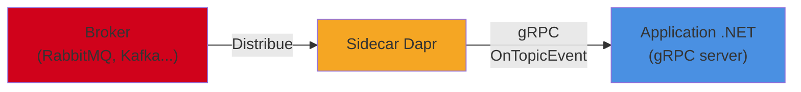
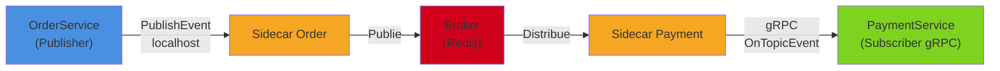

Dans l'article précédent, nous avons vu le Pub/Sub Dapr avec des souscriptions HTTP (Minimal API, contrôleurs). Mais Dapr supporte aussi la communication **gRPC** entre le sidecar et l'application, y compris pour la livraison des messages Pub/Sub. gRPC apporte la sérialisation binaire (Protobuf), des contrats typés et de meilleures performances, ce qui est particulièrement intéressant pour les systèmes à haut débit. Dans cet article, on met en place un système Pub/Sub complet en gRPC.

<!--more-->


# Rappel : HTTP vs gRPC pour le Pub/Sub

Avec le Pub/Sub HTTP (article précédent), le sidecar Dapr appelle un endpoint HTTP de votre application pour lui livrer les messages :

```
Sidecar → POST http://localhost:<app-port>/order-created → Application
```

Avec le **Pub/Sub gRPC**, le sidecar communique avec votre application via un **service gRPC Dapr** que votre application implémente. Le sidecar appelle la méthode `OnTopicEvent` de ce service pour livrer chaque message :

```
Sidecar → gRPC OnTopicEvent → Application
```



Les deux protocoles sont **interchangeables** : le publisher peut publier en HTTP et le subscriber recevoir en gRPC (ou inversement). Le broker et l'API de publication restent identiques. Seule la **livraison au subscriber** change.

# Quand utiliser gRPC plutôt que HTTP ?

| Critère | HTTP | gRPC |
|---------|------|------|
| **Simplicité** | Plus simple (Minimal API, `[Topic]`) | Plus de code (Protobuf, service gRPC) |
| **Performance** | Bon (JSON, HTTP/1.1) | Meilleur (binaire, HTTP/2) |
| **Débit élevé** | Suffisant pour la plupart des cas | Préférable pour les volumes importants |
| **Contrat** | Implicite (sérialisation JSON) | Explicite (fichier `.proto`) |
| **Streaming** | Non supporté | Possible (server streaming) |
| **Cas d'usage** | La majorité des applications | Systèmes à haut débit, événements volumineux |

En pratique, le mode HTTP convient à la majorité des scénarios. L'utilisation de gRPC se justifie principalement quand :

- Vous traitez un **volume élevé de messages** et la performance de sérialisation/désérialisation est critique.
- Vous utilisez déjà des services **gRPC** et souhaitez unifier le protocole.
- Vous avez besoin de **contrats Protobuf** partagés pour vos événements.

# Architecture de l'exemple

On va construire un système Pub/Sub gRPC complet :

1. **OrderService** : publie des événements `OrderCreated` (en HTTP ou gRPC — la publication ne change pas).
2. **PaymentService** : subscriber gRPC qui reçoit les événements `OrderCreated` et simule un traitement de paiement.



# Étape 1 : Le publisher (identique à HTTP)

La publication d'événements ne change pas, qu'on utilise HTTP ou gRPC côté subscriber. Le publisher utilise toujours `DaprClient.PublishEventAsync` :

```csharp
var builder = WebApplication.CreateBuilder(args);
builder.Services.AddDaprClient();
var app = builder.Build();

app.MapPost("/orders", async (CreateOrderRequest request, DaprClient dapr) =>
{
    var order = new Order
    {
        Id = Guid.NewGuid().ToString(),
        CustomerId = request.CustomerId,
        TotalAmount = request.TotalAmount,
        Status = "Created",
        CreatedAt = DateTime.UtcNow
    };

    await dapr.PublishEventAsync("pubsub", "orders", new OrderCreated
    {
        OrderId = order.Id,
        CustomerId = order.CustomerId,
        TotalAmount = order.TotalAmount,
        CreatedAt = order.CreatedAt
    });

    return Results.Created($"/orders/{order.Id}", order);
});

app.Run();
```

# Étape 2 : Le subscriber gRPC

## Créer le projet

```dotnetcli
dotnet new grpc -n PaymentService
cd PaymentService
dotnet add package Dapr.AspNetCore
dotnet add package Dapr.Client
```

## Comprendre le contrat Dapr AppCallback

Dapr fournit un fichier proto qui définit le service `AppCallback`. C'est ce service que votre application doit implémenter pour recevoir les événements via gRPC. Les méthodes clés sont :

- `ListTopicSubscriptions` : appelée par le sidecar au démarrage pour connaître les topics auxquels l'application est abonnée.
- `OnTopicEvent` : appelée par le sidecar pour chaque message reçu.

Le fichier proto de Dapr (`appcallback.proto`) définit ces méthodes :

```protobuf
syntax = "proto3";

package dapr.proto.runtime.v1;

import "google/protobuf/empty.proto";
import "google/protobuf/any.proto";
import "google/protobuf/struct.proto";

// AppCallback est le service que l'application doit implémenter
service AppCallback {
  // Appelé par le sidecar pour connaître les souscriptions
  rpc ListTopicSubscriptions(google.protobuf.Empty)
      returns (ListTopicSubscriptionsResponse);

  // Appelé par le sidecar pour chaque événement reçu
  rpc OnTopicEvent(TopicEventRequest) returns (TopicEventResponse);
}

message TopicEventRequest {
  string id = 1;             // ID unique de l'événement (CloudEvents)
  string source = 2;         // Source de l'événement
  string type = 3;           // Type de l'événement
  string spec_version = 4;   // Version CloudEvents
  string data_content_type = 5; // Content-type du payload
  bytes data = 6;            // Le payload sérialisé
  string topic = 7;          // Le topic d'où vient le message
  string pubsub_name = 8;    // Le nom du composant pub/sub
  string path = 9;           // Le chemin de routage
  map<string, string> extensions = 10; // Extensions CloudEvents
}

message TopicEventResponse {
  TopicEventResponseStatus status = 1;
}

enum TopicEventResponseStatus {
  SUCCESS = 0;   // Message traité avec succès
  RETRY = 1;     // Demander au sidecar de re-livrer
  DROP = 2;      // Abandonner le message
}

message TopicSubscription {
  string pubsub_name = 1;
  string topic = 2;
  map<string, string> metadata = 3;
  TopicRoutes routes = 4;
  string dead_letter_topic = 5;
  BulkSubscribeConfig bulk_subscribe = 6;
}

message TopicRoutes {
  repeated TopicRule rules = 1;
  string default = 2;
}

message TopicRule {
  string match = 1;
  string path = 2;
}

message BulkSubscribeConfig {
  bool enabled = 1;
  int32 max_messages_count = 2;
  int32 max_await_duration_ms = 3;
}

message ListTopicSubscriptionsResponse {
  repeated TopicSubscription subscriptions = 1;
}
```

> Vous n'avez pas besoin de copier ce fichier manuellement : le package NuGet `Dapr.AspNetCore` inclut déjà les protos Dapr et le code généré.

## Implémenter le service AppCallback

Le SDK Dapr pour .NET fournit la classe de base `AppCallback.AppCallbackBase` qu'on peut surcharger :

```csharp
using System.Text.Json;
using Dapr.AppCallback.Autogen.Grpc.v1;
using Dapr.Client.Autogen.Grpc.v1;
using Google.Protobuf.WellKnownTypes;
using Grpc.Core;

namespace PaymentService.Services;

public class DaprSubscriberService : AppCallback.AppCallbackBase
{
    private readonly ILogger<DaprSubscriberService> _logger;

    public DaprSubscriberService(ILogger<DaprSubscriberService> logger)
    {
        _logger = logger;
    }

    /// <summary>
    /// Déclaration des souscriptions auprès du sidecar.
    /// Appelée automatiquement par le sidecar au démarrage.
    /// </summary>
    public override Task<ListTopicSubscriptionsResponse> ListTopicSubscriptions(
        Empty request, ServerCallContext context)
    {
        var response = new ListTopicSubscriptionsResponse();

        // S'abonner au topic "orders" du composant "pubsub"
        response.Subscriptions.Add(new TopicSubscription
        {
            PubsubName = "pubsub",
            Topic = "orders",
            DeadLetterTopic = "orders-deadletter"
        });

        // S'abonner au topic "payments" du composant "pubsub"
        response.Subscriptions.Add(new TopicSubscription
        {
            PubsubName = "pubsub",
            Topic = "payments"
        });

        return Task.FromResult(response);
    }

    /// <summary>
    /// Réception d'un événement. Appelée par le sidecar pour chaque message.
    /// </summary>
    public override async Task<TopicEventResponse> OnTopicEvent(
        TopicEventRequest request, ServerCallContext context)
    {
        _logger.LogInformation(
            "Événement reçu - Topic: {Topic}, Source: {Source}, Id: {Id}",
            request.Topic, request.Source, request.Id);

        try
        {
            return request.Topic switch
            {
                "orders" => await HandleOrderCreatedAsync(request),
                "payments" => await HandlePaymentEventAsync(request),
                _ => new TopicEventResponse
                {
                    Status = TopicEventResponse.Types.TopicEventResponseStatus.Drop
                }
            };
        }
        catch (Exception ex)
        {
            _logger.LogError(ex, "Erreur lors du traitement de l'événement {Id}", request.Id);

            // Demander au sidecar de re-livrer le message
            return new TopicEventResponse
            {
                Status = TopicEventResponse.Types.TopicEventResponseStatus.Retry
            };
        }
    }

    private async Task<TopicEventResponse> HandleOrderCreatedAsync(TopicEventRequest request)
    {
        // Désérialiser le payload depuis les bytes
        var orderCreated = JsonSerializer.Deserialize<OrderCreated>(
            request.Data.ToStringUtf8(),
            new JsonSerializerOptions { PropertyNameCaseInsensitive = true });

        if (orderCreated is null)
        {
            return new TopicEventResponse
            {
                Status = TopicEventResponse.Types.TopicEventResponseStatus.Drop
            };
        }

        _logger.LogInformation(
            "Traitement du paiement pour la commande {OrderId}, montant : {Amount}€",
            orderCreated.OrderId, orderCreated.TotalAmount);

        // Simuler le traitement du paiement
        await Task.Delay(200);

        _logger.LogInformation("Paiement validé pour la commande {OrderId}",
            orderCreated.OrderId);

        return new TopicEventResponse
        {
            Status = TopicEventResponse.Types.TopicEventResponseStatus.Success
        };
    }

    private async Task<TopicEventResponse> HandlePaymentEventAsync(TopicEventRequest request)
    {
        _logger.LogInformation("Événement de paiement reçu : {Data}",
            request.Data.ToStringUtf8());

        await Task.CompletedTask;

        return new TopicEventResponse
        {
            Status = TopicEventResponse.Types.TopicEventResponseStatus.Success
        };
    }
}
```

## Configurer `Program.cs`

```csharp
using PaymentService.Services;

var builder = WebApplication.CreateBuilder(args);

builder.Services.AddGrpc();

var app = builder.Build();

// Enregistrer le service AppCallback pour le sidecar Dapr
app.MapGrpcService<DaprSubscriberService>();

app.Run();
```

## Configuration Kestrel

Le service doit écouter en HTTP/2 (requis par gRPC) :

```json
{
  "Kestrel": {
    "Endpoints": {
      "Grpc": {
        "Url": "http://localhost:5010",
        "Protocols": "Http2"
      }
    }
  }
}
```

> On utilise `http` (pas `https`) car le sidecar Dapr gère le mTLS entre les services. La communication entre l'application et son propre sidecar reste locale.

# Souscriptions avancées en gRPC

## Souscription avec routage

On peut ajouter des règles de routage directement dans `ListTopicSubscriptions` :

```csharp
public override Task<ListTopicSubscriptionsResponse> ListTopicSubscriptions(
    Empty request, ServerCallContext context)
{
    var response = new ListTopicSubscriptionsResponse();

    response.Subscriptions.Add(new TopicSubscription
    {
        PubsubName = "pubsub",
        Topic = "orders",
        Routes = new TopicRoutes
        {
            Default = "default",
            Rules =
            {
                new TopicRule
                {
                    Match = "event.data.status == \"created\"",
                    Path = "created"
                },
                new TopicRule
                {
                    Match = "event.data.status == \"paid\"",
                    Path = "paid"
                }
            }
        }
    });

    return Task.FromResult(response);
}
```

Le champ `Path` de la règle est ensuite accessible dans `TopicEventRequest.Path`, ce qui permet de dispatcher dans `OnTopicEvent` :

```csharp
public override async Task<TopicEventResponse> OnTopicEvent(
    TopicEventRequest request, ServerCallContext context)
{
    return request.Path switch
    {
        "created" => await HandleOrderCreatedAsync(request),
        "paid" => await HandleOrderPaidAsync(request),
        "default" => await HandleDefaultAsync(request),
        _ => new TopicEventResponse
        {
            Status = TopicEventResponse.Types.TopicEventResponseStatus.Drop
        }
    };
}
```

## Souscription avec métadonnées

On peut ajouter des métadonnées à la souscription (par exemple, pour spécifier un consumer group Kafka) :

```csharp
var subscription = new TopicSubscription
{
    PubsubName = "pubsub",
    Topic = "orders"
};
subscription.Metadata.Add("consumerGroup", "payment-processors");
subscription.Metadata.Add("maxConcurrency", "10");

response.Subscriptions.Add(subscription);
```

## Souscription avec dead letter topic

```csharp
response.Subscriptions.Add(new TopicSubscription
{
    PubsubName = "pubsub",
    Topic = "orders",
    DeadLetterTopic = "orders-deadletter"
});

// S'abonner aussi au dead letter topic pour monitoring
response.Subscriptions.Add(new TopicSubscription
{
    PubsubName = "pubsub",
    Topic = "orders-deadletter"
});
```

## Souscription en bulk

Pour recevoir les messages par lots :

```csharp
response.Subscriptions.Add(new TopicSubscription
{
    PubsubName = "pubsub",
    Topic = "orders",
    BulkSubscribe = new BulkSubscribeConfig
    {
        Enabled = true,
        MaxMessagesCount = 50,
        MaxAwaitDurationMs = 1000
    }
});
```

# Pattern : séparation par handlers typés

Pour un code plus maintenable, on peut introduire un pattern de dispatch typé :

## Interface de handler

```csharp
public interface ITopicHandler<TEvent>
{
    string PubSubName { get; }
    string TopicName { get; }
    Task<TopicEventResponse.Types.TopicEventResponseStatus> HandleAsync(
        TEvent evt, CancellationToken ct);
}
```

## Implémentation des handlers

```csharp
public class OrderCreatedHandler : ITopicHandler<OrderCreated>
{
    private readonly ILogger<OrderCreatedHandler> _logger;

    public OrderCreatedHandler(ILogger<OrderCreatedHandler> logger)
    {
        _logger = logger;
    }

    public string PubSubName => "pubsub";
    public string TopicName => "orders";

    public async Task<TopicEventResponse.Types.TopicEventResponseStatus> HandleAsync(
        OrderCreated evt, CancellationToken ct)
    {
        _logger.LogInformation(
            "Traitement du paiement pour {OrderId} ({Amount}€)",
            evt.OrderId, evt.TotalAmount);

        // Logique de paiement...
        await Task.Delay(100, ct);

        return TopicEventResponse.Types.TopicEventResponseStatus.Success;
    }
}

public class PaymentConfirmedHandler : ITopicHandler<PaymentConfirmed>
{
    private readonly ILogger<PaymentConfirmedHandler> _logger;

    public PaymentConfirmedHandler(ILogger<PaymentConfirmedHandler> logger)
    {
        _logger = logger;
    }

    public string PubSubName => "pubsub";
    public string TopicName => "payment-confirmed";

    public async Task<TopicEventResponse.Types.TopicEventResponseStatus> HandleAsync(
        PaymentConfirmed evt, CancellationToken ct)
    {
        _logger.LogInformation("Paiement {PaymentId} confirmé", evt.PaymentId);
        await Task.CompletedTask;
        return TopicEventResponse.Types.TopicEventResponseStatus.Success;
    }
}
```

## Service AppCallback avec dispatch

```csharp
public class DaprSubscriberService : AppCallback.AppCallbackBase
{
    private readonly IServiceProvider _serviceProvider;
    private readonly ILogger<DaprSubscriberService> _logger;

    // Mapping topic → (type événement, type handler)
    private static readonly Dictionary<string, (Type EventType, Type HandlerType)> _topicMap = new()
    {
        ["orders"] = (typeof(OrderCreated), typeof(ITopicHandler<OrderCreated>)),
        ["payment-confirmed"] = (typeof(PaymentConfirmed), typeof(ITopicHandler<PaymentConfirmed>))
    };

    public DaprSubscriberService(
        IServiceProvider serviceProvider,
        ILogger<DaprSubscriberService> logger)
    {
        _serviceProvider = serviceProvider;
        _logger = logger;
    }

    public override Task<ListTopicSubscriptionsResponse> ListTopicSubscriptions(
        Empty request, ServerCallContext context)
    {
        var response = new ListTopicSubscriptionsResponse();

        foreach (var (topic, _) in _topicMap)
        {
            response.Subscriptions.Add(new TopicSubscription
            {
                PubsubName = "pubsub",
                Topic = topic
            });
        }

        return Task.FromResult(response);
    }

    public override async Task<TopicEventResponse> OnTopicEvent(
        TopicEventRequest request, ServerCallContext context)
    {
        if (!_topicMap.TryGetValue(request.Topic, out var mapping))
        {
            _logger.LogWarning("Topic inconnu : {Topic}", request.Topic);
            return new TopicEventResponse
            {
                Status = TopicEventResponse.Types.TopicEventResponseStatus.Drop
            };
        }

        try
        {
            // Désérialiser l'événement dans le type attendu
            var evt = JsonSerializer.Deserialize(
                request.Data.ToStringUtf8(),
                mapping.EventType,
                new JsonSerializerOptions { PropertyNameCaseInsensitive = true });

            if (evt is null)
            {
                return new TopicEventResponse
                {
                    Status = TopicEventResponse.Types.TopicEventResponseStatus.Drop
                };
            }

            // Résoudre le handler depuis le conteneur DI
            var handler = _serviceProvider.GetRequiredService(mapping.HandlerType);

            // Appeler HandleAsync via réflexion
            var method = mapping.HandlerType.GetMethod("HandleAsync")!;
            var resultTask = (Task<TopicEventResponse.Types.TopicEventResponseStatus>)
                method.Invoke(handler, [evt, context.CancellationToken])!;

            var status = await resultTask;

            return new TopicEventResponse { Status = status };
        }
        catch (Exception ex)
        {
            _logger.LogError(ex, "Erreur sur le topic {Topic}", request.Topic);
            return new TopicEventResponse
            {
                Status = TopicEventResponse.Types.TopicEventResponseStatus.Retry
            };
        }
    }
}
```

## Enregistrement DI

```csharp
var builder = WebApplication.CreateBuilder(args);

builder.Services.AddGrpc();

// Enregistrer les handlers
builder.Services.AddScoped<ITopicHandler<OrderCreated>, OrderCreatedHandler>();
builder.Services.AddScoped<ITopicHandler<PaymentConfirmed>, PaymentConfirmedHandler>();

var app = builder.Build();
app.MapGrpcService<DaprSubscriberService>();
app.Run();
```

Ce pattern sépare proprement les responsabilités : le service `AppCallback` ne fait que du dispatch, et chaque handler contient la logique métier de son événement.

# Événements Protobuf (au lieu de JSON)

Si vous voulez aller au bout de la logique gRPC, vous pouvez définir vos événements en Protobuf :

## Définir les événements dans un fichier proto

```protobuf
syntax = "proto3";

option csharp_namespace = "SharedContracts";

package events;

message OrderCreatedEvent {
  string order_id = 1;
  string customer_id = 2;
  double total_amount = 3;
  int64 created_at_unix = 4;  // Timestamp Unix en secondes
  repeated OrderItemEvent items = 5;
}

message OrderItemEvent {
  int32 product_id = 1;
  string name = 2;
  double price = 3;
  int32 quantity = 4;
}

message PaymentConfirmedEvent {
  string payment_id = 1;
  string order_id = 2;
  double amount = 3;
  string payment_method = 4;
  int64 confirmed_at_unix = 5;
}
```

## Publier un événement Protobuf

Pour publier un message Protobuf via Dapr, on le sérialise en bytes et on utilise l'API HTTP du sidecar avec le content-type approprié :

```csharp
public async Task PublishProtobufEventAsync(OrderCreatedEvent evt)
{
    // Sérialiser en bytes Protobuf
    var bytes = evt.ToByteArray();

    // Publier via l'API HTTP du sidecar avec le content-type Protobuf
    using var httpClient = new HttpClient();
    var content = new ByteArrayContent(bytes);
    content.Headers.ContentType =
        new System.Net.Http.Headers.MediaTypeHeaderValue("application/octet-stream");

    var daprPort = Environment.GetEnvironmentVariable("DAPR_HTTP_PORT") ?? "3500";
    var response = await httpClient.PostAsync(
        $"http://localhost:{daprPort}/v1.0/publish/pubsub/orders?metadata.rawPayload=true",
        content);

    response.EnsureSuccessStatusCode();
}
```

## Recevoir un événement Protobuf

Côté subscriber gRPC, on désérialise les bytes Protobuf depuis `TopicEventRequest.Data` :

```csharp
private async Task<TopicEventResponse> HandleOrderCreatedProtobufAsync(
    TopicEventRequest request)
{
    // Désérialiser les bytes Protobuf
    var orderCreated = OrderCreatedEvent.Parser.ParseFrom(request.Data);

    _logger.LogInformation(
        "Commande {OrderId} reçue (Protobuf), montant : {Amount}€, {ItemCount} articles",
        orderCreated.OrderId,
        orderCreated.TotalAmount,
        orderCreated.Items.Count);

    // Traitement...
    await Task.Delay(100);

    return new TopicEventResponse
    {
        Status = TopicEventResponse.Types.TopicEventResponseStatus.Success
    };
}
```

L'avantage de Protobuf : la sérialisation/désérialisation est **beaucoup plus rapide** et les messages sont **plus compacts** que le JSON, ce qui réduit la bande passante et la latence, surtout à haut débit.

# Combiner publication gRPC et souscription gRPC

On peut aussi publier des événements via l'API gRPC du sidecar au lieu de l'API HTTP :

```csharp
using Dapr.Client;

public class EventPublisher
{
    private readonly DaprClient _daprClient;

    public EventPublisher(DaprClient daprClient)
    {
        _daprClient = daprClient;
    }

    public async Task PublishOrderCreatedAsync(OrderCreated order)
    {
        // DaprClient utilise gRPC par défaut pour communiquer avec le sidecar
        await _daprClient.PublishEventAsync("pubsub", "orders", order);
    }
}
```

Pour forcer l'utilisation de gRPC côté `DaprClient` :

```csharp
builder.Services.AddDaprClient(daprBuilder =>
{
    var grpcPort = Environment.GetEnvironmentVariable("DAPR_GRPC_PORT") ?? "50001";
    daprBuilder.UseGrpcEndpoint($"http://localhost:{grpcPort}");
});
```

# Exemple complet : PaymentService gRPC

Voici le service complet avec handler, publication de réponse, et monitoring :

## Program.cs

```csharp
using PaymentService.Services;
using PaymentService.Handlers;

var builder = WebApplication.CreateBuilder(args);

builder.Services.AddGrpc();
builder.Services.AddDaprClient();

// Enregistrer les handlers
builder.Services.AddScoped<ITopicHandler<OrderCreated>, OrderPaymentHandler>();

var app = builder.Build();

app.MapGrpcService<DaprSubscriberService>();

app.Run();
```

## Le handler métier

```csharp
using Dapr.Client;

namespace PaymentService.Handlers;

public class OrderPaymentHandler : ITopicHandler<OrderCreated>
{
    private readonly DaprClient _daprClient;
    private readonly ILogger<OrderPaymentHandler> _logger;

    public OrderPaymentHandler(DaprClient daprClient, ILogger<OrderPaymentHandler> logger)
    {
        _daprClient = daprClient;
        _logger = logger;
    }

    public string PubSubName => "pubsub";
    public string TopicName => "orders";

    public async Task<TopicEventResponse.Types.TopicEventResponseStatus> HandleAsync(
        OrderCreated evt, CancellationToken ct)
    {
        _logger.LogInformation(
            "Début du traitement de paiement pour la commande {OrderId}", evt.OrderId);

        // Vérifier l'idempotence via le state store
        var alreadyProcessed = await _daprClient.GetStateAsync<bool>(
            "statestore", $"payment-processed-{evt.OrderId}", cancellationToken: ct);

        if (alreadyProcessed)
        {
            _logger.LogInformation(
                "Commande {OrderId} déjà traitée, skip", evt.OrderId);
            return TopicEventResponse.Types.TopicEventResponseStatus.Success;
        }

        // Simuler le traitement du paiement
        var paymentResult = await ProcessPaymentAsync(evt, ct);

        if (paymentResult.Success)
        {
            // Marquer comme traité
            await _daprClient.SaveStateAsync(
                "statestore", $"payment-processed-{evt.OrderId}", true,
                cancellationToken: ct);

            // Publier un événement de confirmation
            await _daprClient.PublishEventAsync("pubsub", "payment-confirmed",
                new PaymentConfirmed
                {
                    PaymentId = paymentResult.PaymentId,
                    OrderId = evt.OrderId,
                    Amount = evt.TotalAmount,
                    ConfirmedAt = DateTime.UtcNow
                }, ct);

            _logger.LogInformation(
                "Paiement {PaymentId} confirmé pour la commande {OrderId}",
                paymentResult.PaymentId, evt.OrderId);

            return TopicEventResponse.Types.TopicEventResponseStatus.Success;
        }

        _logger.LogWarning(
            "Échec du paiement pour la commande {OrderId} : {Reason}",
            evt.OrderId, paymentResult.FailureReason);

        // Publier un événement d'échec
        await _daprClient.PublishEventAsync("pubsub", "payment-failed",
            new PaymentFailed
            {
                OrderId = evt.OrderId,
                Reason = paymentResult.FailureReason ?? "Unknown"
            }, ct);

        // Ne pas retrier : le paiement a échoué pour une raison métier
        return TopicEventResponse.Types.TopicEventResponseStatus.Success;
    }

    private async Task<PaymentResult> ProcessPaymentAsync(
        OrderCreated order, CancellationToken ct)
    {
        // Simulation de traitement
        await Task.Delay(500, ct);

        return new PaymentResult
        {
            Success = true,
            PaymentId = Guid.NewGuid().ToString()
        };
    }
}
```

## Les modèles

```csharp
public record OrderCreated
{
    public string OrderId { get; init; } = string.Empty;
    public string CustomerId { get; init; } = string.Empty;
    public decimal TotalAmount { get; init; }
    public DateTime CreatedAt { get; init; }
}

public record PaymentConfirmed
{
    public string PaymentId { get; init; } = string.Empty;
    public string OrderId { get; init; } = string.Empty;
    public decimal Amount { get; init; }
    public DateTime ConfirmedAt { get; init; }
}

public record PaymentFailed
{
    public string OrderId { get; init; } = string.Empty;
    public string Reason { get; init; } = string.Empty;
}

public record PaymentResult
{
    public bool Success { get; init; }
    public string PaymentId { get; init; } = string.Empty;
    public string? FailureReason { get; init; }
}
```

# Lancement en local

```bash
# Terminal 1 : OrderService (publisher HTTP)
dapr run --app-id order-service --app-port 5000 \
    --resources-path ./components -- dotnet run --project OrderService

# Terminal 2 : PaymentService (subscriber gRPC)
dapr run --app-id payment-service \
         --app-port 5010 \
         --app-protocol grpc \
         --resources-path ./components \
         -- dotnet run --project PaymentService
```

Le flag `--app-protocol grpc` est essentiel : il indique au sidecar que l'application derrière lui communique en gRPC. Sans ce flag, le sidecar tentera de livrer les messages en HTTP, ce qui échouera.

## Tester

```bash
# Créer une commande
curl -X POST http://localhost:5000/orders \
  -H "Content-Type: application/json" \
  -d '{ "customerId": "cust-42", "totalAmount": 149.99 }'
```

Dans les logs du PaymentService, vous devriez voir :

```
info: PaymentService.Handlers.OrderPaymentHandler
      Début du traitement de paiement pour la commande abc-123
info: PaymentService.Handlers.OrderPaymentHandler
      Paiement def-456 confirmé pour la commande abc-123
```

# Lancement avec .NET Aspire

```csharp
var builder = DistributedApplication.CreateBuilder(args);

var pubSub = builder.AddDaprPubSub("pubsub");
var stateStore = builder.AddDaprStateStore("statestore");

builder.AddProject<Projects.OrderService>("order-service")
    .WithDaprSidecar()
    .WithReference(pubSub)
    .WithReference(stateStore);

builder.AddProject<Projects.PaymentService>("payment-service")
    .WithDaprSidecar(new DaprSidecarOptions
    {
        AppProtocol = "grpc"
    })
    .WithReference(pubSub)
    .WithReference(stateStore);

builder.Build().Run();
```

# HTTP vs gRPC : récapitulatif Pub/Sub

| Aspect | Pub/Sub HTTP | Pub/Sub gRPC |
|--------|-------------|--------------|
| **Souscription** | `[Topic]` attribut, Minimal API | `ListTopicSubscriptions` override |
| **Réception** | Endpoint HTTP POST | `OnTopicEvent` override |
| **Sérialisation** | JSON automatique | JSON ou Protobuf (manuel) |
| **Dispatch** | Routage ASP.NET Core natif | Switch/dispatch dans `OnTopicEvent` |
| **Performance** | Bon | Meilleur (HTTP/2 binaire) |
| **Simplicité** | Plus simple | Plus de code |
| **Flag sidecar** | `--app-protocol http` (défaut) | `--app-protocol grpc` |
| **Cas d'usage** | Majorité des applications | Haut débit, écosystème gRPC existant |

# Résumé

| Aspect | Détail |
|--------|--------|
| **Protocole** | gRPC entre le sidecar et l'application subscriber |
| **Service** | Implémenter `AppCallback.AppCallbackBase` (Dapr SDK) |
| **Souscriptions** | `ListTopicSubscriptions` : déclare les topics, routes, dead letters |
| **Réception** | `OnTopicEvent` : reçoit chaque message avec topic, payload, métadonnées |
| **Réponse** | `Success` (ACK), `Retry` (re-livraison), `Drop` (abandon) |
| **Sérialisation** | JSON par défaut, Protobuf possible pour de meilleures performances |
| **Flag** | `--app-protocol grpc` obligatoire au lancement du subscriber |
| **Routage** | Règles de routage via `TopicRoutes` dans la souscription |
| **Publication** | Identique (HTTP ou gRPC via `DaprClient.PublishEventAsync`) |
| **Aspire** | `AppProtocol = "grpc"` dans `DaprSidecarOptions` |

Le Pub/Sub gRPC de Dapr est le choix naturel pour les services déjà construits autour de gRPC ou pour les scénarios à haut débit où la performance de sérialisation et la compacité des messages font la différence, tout en conservant les mêmes garanties de livraison et la même portabilité entre brokers que le mode HTTP.
